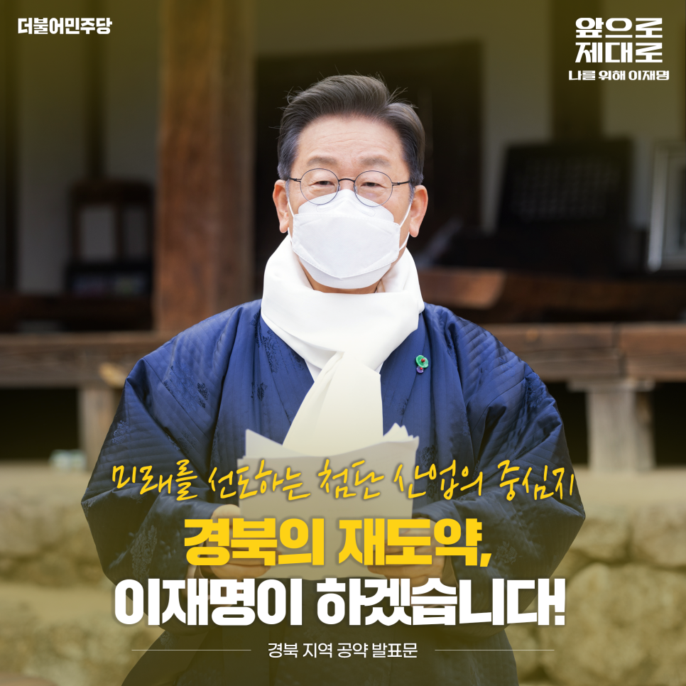
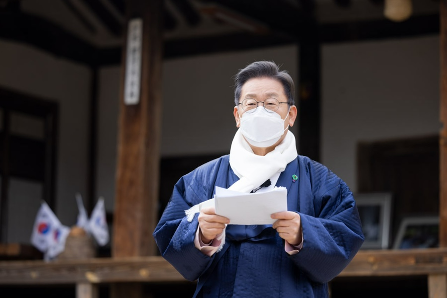
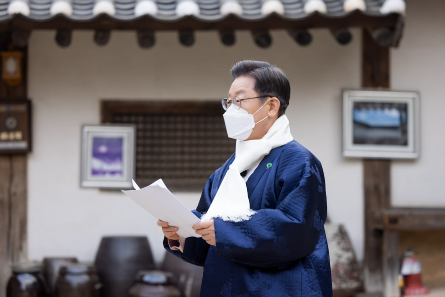

## 지역공약
# 미래를 선도하는 첨단 산업의 중심지 경북의 재도약, 이재명이 하겠습니다
> 2022-02-04 17:47:02

존경하는 경북도민 여러분 저의 태를 묻었고, 제 부모님을 모셨고, 앞으로 제 육신을 묻게 될 이곳 안동에서 여러분께 인사드립니다. 안동 삼계초등학교를 졸업하자마자 고향을 떠날 수밖에 없었던 한 경북 소년이 이제 대통령 후보가 돼서 다시 그리운 고향 땅을 찾았습니다.

​

화전을 일궈서 입에 풀칠을 했을 정도로 가난한 집 안에서 나고 자랐기 때문에 먹고 사는 문제가 얼마나 소중한 것인지 잘 알고 있습니다. 그 절박함이 저를 이 자리까지 오게 만들었습니다.

​

지금 경북에서는 5년마다 1개 군이 사라지고 있다고 합니다. 매년 8천 명에 이르는 젊은이가 고향을 등지고 있고, 북부권의 6개 군이 이미 소멸 고위험에 처해 있습니다.

​

극약 처방이 필요하게 됐습니다. 노후화된 산업시설을 미래형으로 대전환하고, 교통 오지 경북에 사통팔달의 교통망을 구축해서 피를 돌게 하고 생기를 불어 넣어야 합니다.

​

안동 영주를 중심으로 한 북부권, 구미 김천을 중심으로 한 서부권, 포항 경주를 중심으로 한 동남권을 경북의 3대 성장 거점으로 형성하고, 바이오 미래형 첨단산업을 집중 육성해서 청년들이 고향을 떠나지 않고도 먹고 살 수 있는 그런 경북을 만들겠습니다.

​

경북의 기존 정치세력이 하지 못했던 일, 저 이재명이 반드시 실행하겠습니다.

첫째, 경북의 미래형 친환경 자동차 부품 산업을 육성하겠습니다.

내연기관 자동차가 멈춰 서는 날이 얼마 남지 않았습니다. 미래형 친환경 산업의 대전환을 반드시 성공시켜야만 경북의 미래도 있습니다.

​

경북의 주력 산업인 자동차 부품 산업을 미래형 친환경 자동차 부품산업으로 전환해서 재도약의 기회를 키우고 대규모 일자리를 창출해 내겠습니다.

​

연구개발센터와 스마트 생산 설비를 갖춘 미래형 친환경 자동차 클러스터를 조성하고, 입주기업 초기 투자를 위한 금융세제 지원을 강화하겠습니다.

​

지역 인재 육성과 재교육 시스템이 반드시 필요합니다. 구미에 들어설 로봇 직업 혁신센터와 지역 주요 대학과 로봇 자동차 관련 연구소를 연결해서 전문 인력 확보와 기존 종사자의 재교육을 동시에 해결해 나가겠습니다.

​

미생물과 식물을 이용한 화이트바이오 섬유산업 육성에도 관심을 쏟겠습니다.

둘째, 구미 포항권에 2차 전지 소재 산업 라인을 구축하겠습니다.

빠르게 성장하고 있는 2차 전지 소재 산업이 경북에 뿌리 내릴 수 있도록 하겠습니다.

​

구미의 2차 전지 양극재 산업과 포항에 배터리 리사이클링 규제자유특구가 결합된 2차 전지 소재 산업 벨트를 구축하겠습니다.

​

2019년 체결된 상생형 국민 일자리 투자 협약은 2차 전지 양극재 공장 착공으로 본격화될 것입니다. 투자 협약이 국가 산업과 일자리, 지역 일자리 창출에 기여할 수 있도록 적극 지원하겠습니다.

​

홍준표 전 대표께서 구미에 공략하신 바를 실사구시적으로 수용해서 구미공단 스마트 재구조화를 조속히 완결하겠습니다.

​

전국에서 가장 모범적인 성공 사례가 될 수 있도록 지원해서 구미 경제의 재도약을 이끌어내겠습니다.

셋째, 경북의 글로벌 백신 의료산업 벨트를 조성하겠습니다.

코로나19를 포함한 감염병은 하루 이틀로 끝날 문제가 아닙니다. 국내 백신 의료 산업을 육성해서 장기전에 대비해야 합니다. 경북을 그 중심으로 만들겠습니다.

​

2020년 경북 안동에 동물세포실증지원센터가 완공됐습니다. 이미 유치된 경북바이오산업연구원 국제백신연구소 분원과 연계해서 경북을 글로벌 백신 의료산업 벨트의 핵심 거점으로 성장시키겠습니다.

​

경북에 백신 첨단 투자지구와 백신 규제 자유특구가 지정될 수 있도록 해서 백신 등 바이오 기업이 경북에 모일 수 있도록 하겠습니다.

​

넷째, 경북 동남권에 과학기술 중심의 신산업 생태계를 조성하겠습니다.

포항의 3세대, 4세대 방사광가속기와 경주의 양성자가속기를 반도체, 우주 부품, 6세대 이동통신 등과 같은 첨단 과학기술 산업과 연구 분야에 활용하도록 하겠습니다.

​

동남권 지역에 첨단과학기술 산업단지를 조성해서 경산 학원단지를 비롯한 포항 경주 소재 대학에 우수 인력을 위한 일자리를 만들겠습니다.

​

이를 위해서 현재 100메가전자볼트인 경주의 양성자 가속기를 폭넓게 활용할 수 있는 규모로 확대해서 실질적인 연구와 산업화에 기여하도록 하겠습니다.

​

포항 역시 홍준표 전 대표님의 공약을 적극 수용합니다.

​

포항 수소산업 발전을 위한 다양한 투자를 위해서 수소산업이 포항의 새로운 도약의 디딤돌이 되도록 적극 지원하겠습니다.

다섯 번째, 경북에 동서남북을 잇는 사통팔달의 교통망을 구축하겠습니다.

4차 국가 철도망계획에 반영된 문경~김천 내륙철도, 문재인 정부에서 예타 면제 사업으로 선정된 수서~김천~거제를 잇는 남부내륙철도 사업이 차질 없이 추진될 수 있도록 하겠습니다.

​

KTX 구미역을 신설해서 침체된 우리 국가산단에 재도약의 불씨를 마련하겠습니다.

​

구미와 통합 신공항을 연결해서 기업의 항공 수출의 길을 활짝 열리게 하겠습니다.

​

동서 균형발전의 상징인 중부권 동서횡단철도를 5차 국가철도망 구축 계획에 반영하고, 남북 6축 고속도로 중에서 영천~봉화 구간을 단계적으로 추진해서 교통 오지라는 오명에서 벗어나서 명실상부한 사통팔달의 경북을 만들겠습니다.

​

여섯 번째, 대구경북통합신공항, 울릉공항을 성공적으로 추진하겠습니다.

진지한 숙의 과정을 통해서 결정된 대구경북 통합신공항 추진을 적극 지원하겠습니다.

​

공항이 들어선다고 모든 것이 해결되지는 않습니다. 공항이 재기능을 하기 위해서는 대한민국 어디에서나 사람과 물건이 갈 수 있는 접근성을 높여야 합니다.

​

대구 경북선이 신속히 추진되도록 지원하겠습니다. 구미역부터 통합신공항에 이르는 철도를 적극 검토하겠습니다.

​

포항과 구미에 늘어나는 항공과 해운 물동량에 대비해서 통합 신공항이 중부 내륙 물류와 교통의 핵심 거점이 되도록 하겠습니다.

​

울릉공항 역시 차질 없이 추진하겠습니다.

일곱 번째, 육군사관학교를 안동으로 이전하겠습니다.

안동은 대한민국 현근대사에서 가장 애국지사를 많이 배출한 곳입니다. 그리고 지금 이곳 임청각, 석주 이상룡 선생께서 초대 국무령을 지내시면서 신흥무관학교를 만들어서 무장항쟁의 토대를 쌓았습니다.

​

그 뜻을 기려서 육군사관학교를 이곳 경북 안동으로 이전해서 애국의 정신을 이어갈 수 있도록 하겠습니다.

​

존경하는 경북도민 여러분.

조국의 독립과 근대화 산업화를 이끌었던 혁신 경북이 오늘날 어쩌다가 지방 소멸을 걱정해야 하는 상태에 이르렀습니다.

​

지금까지 믿고 지지해주었던 보수 정권을 탓할 시간도, 또 다시 과거에 사로잡혀서 시행착오를 겪을 여유도 없습니다.

​

지금 이 순간 대전환의 시대에 대비하지 않으면 우리의 미래는 기약 없는 영원한 나락으로 다시 떨어질 수 있습니다.

​

저 이재명이 하겠습니다. 대한민국을 재도약시키고 경북을 다시 일으켜 세우겠습니다. 보수 정당이 하지 못한 일이지만 저는 할 수 있습니다.

​

수도권 집중을 해소 완화하고 실질적인 국가 균형발전을 이루어내는 일, 침체된 지역경제를 살리고 경북을 다시 부흥시키는 일. 말이 아닌 행동으로 보여드리는 저 이재명이, 그리고 특히 실적과 성과로 증명해온 저 이재명이 반드시 해내겠습니다.

​

미래를 선도하는 첨단 산업의 중심지 경북의 재도약, 이재명이 하겠습니다. 고맙습니다.