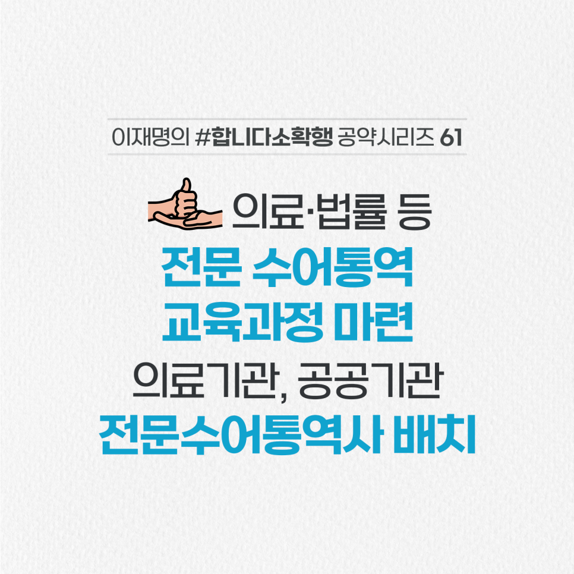

## 소확행 시리즈
# 청각 장애인의 원활한 의사소통 권리 보장! 전문 수어통역 시스템 개선
> 2022-02-04 18:08:22

오늘은 한국 수어의 날입니다.

​

수어는 국가가 법으로 정한, 국어와 동등한 자격을 가진 청각장애인의 고유 언어입니다.

​

한국수화언어법 제2조는 “수어 사용을 이유로 차별받지 않으며, 모든 생활영역에서 수어를 통해 필요한 정보를 제공받을 권리가 있다”고 명시하고 있습니다. 그러나 현실은 그렇지 못합니다.

​

그동안 의사표현이 안돼 아파도, 억울해도 참을 수밖에 없었던 40만 청각장애인의 어려움을 조금이나마 덜어 드리겠습니다.

​

의료·법률 등 전문 분야 수어통역 교육과정을 마련하고, 수어통역센터도 확대하겠습니다.

​

질병, 코로나19 등 의료적 긴급상황이나 송사 등 법적 분쟁 상황에서 누구나 언제든지 원활하게 의사소통할 수 있도록 돕겠습니다.

더 나아가 공공의료기관, 경찰서 등 관공서에도 전문수어통역사를 배치하여 청각장애인의 말씀이 잘 전달되도록 지원하겠습니다.