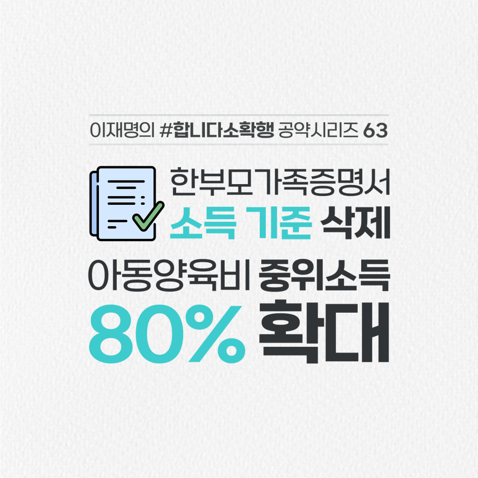

## 소확행 시리즈
# ‘한부모가족증명서’ 소득 기준을 없애고 지원을 대폭 늘리겠습니다
> 2022-02-06 10:44:24

현재 ‘한부모가족증명서’는 한부모가정 중에서도 일정 소득 이하 가정에만 발급됩니다.

​

저소득 가정이라는 것을 증명서로 공개적으로 확인하고 국가가 지원을 해야 할 이유가 꼭 있을까요?

​

한부모가정의 부양과 돌봄을 위해 지원 범위를 넓히고 증명서로 지원 여부를 판단하지 않겠습니다.

​

첫째, 한부모가족증명서 발급에 소득기준을 없애겠습니다.

​

소득과 관계없이 한부모라면 누구나 법률지원, 한부모 복지시설 이용 등 필요한 사회서비스를 누리도록 하겠습니다.

​

둘째, ‘한부모 아동양육비’ 지급 대상을 중위소득 80% 이하까지 단계적으로 확대하겠습니다.

​

더 많은 한부모 자녀가 보다 안정적인 환경에서 성장하도록 돕겠습니다. 부모가 수급 대상에서 탈락할까봐 돈을 더 벌고 싶어도 벌 수 없는 일이 없도록 하겠습니다.

​

한부모가족의 어려움을 국가가 더 빈틈없이 메우겠습니다.

