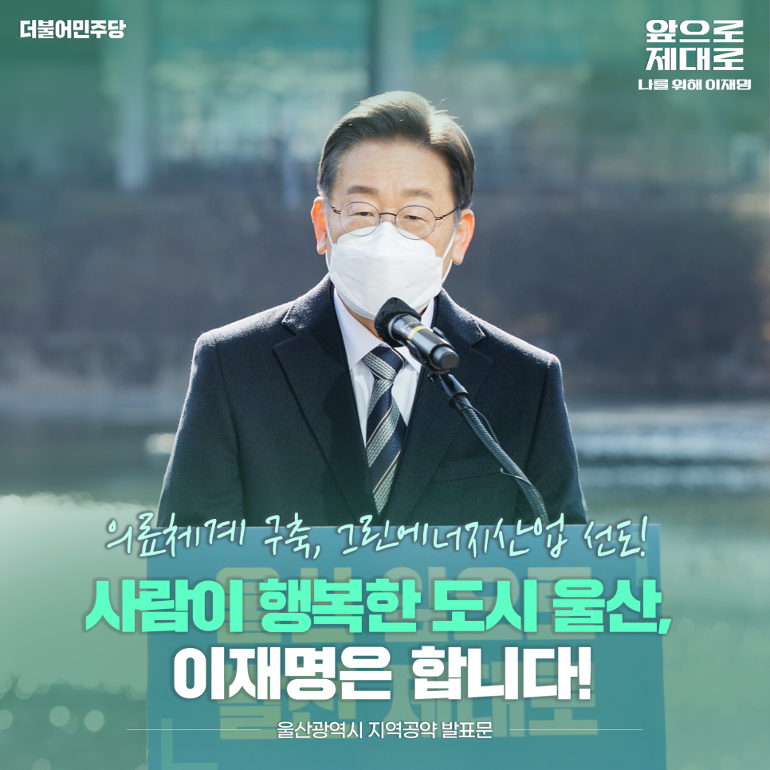
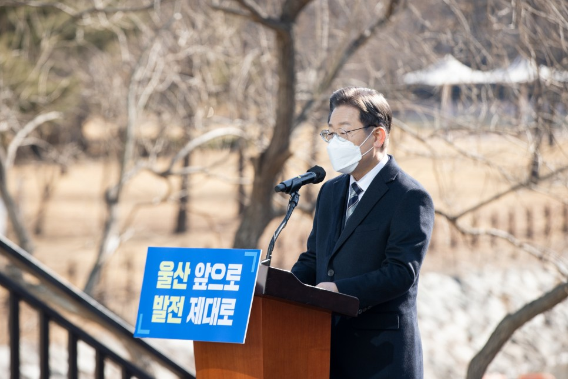
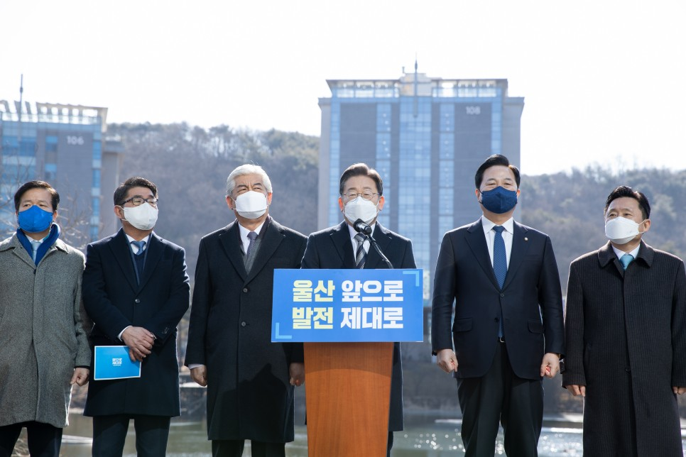
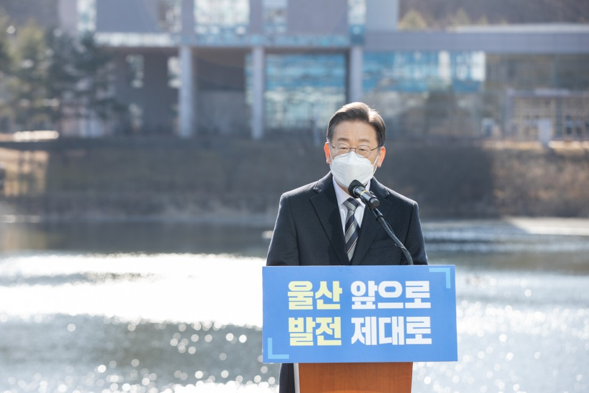
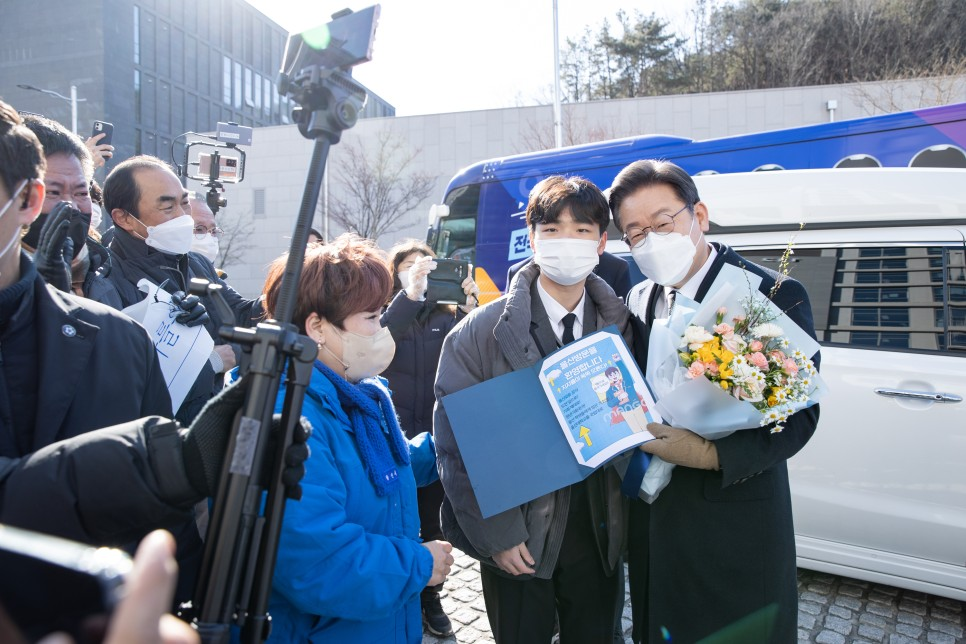
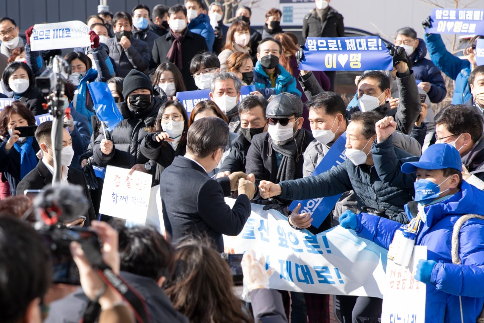
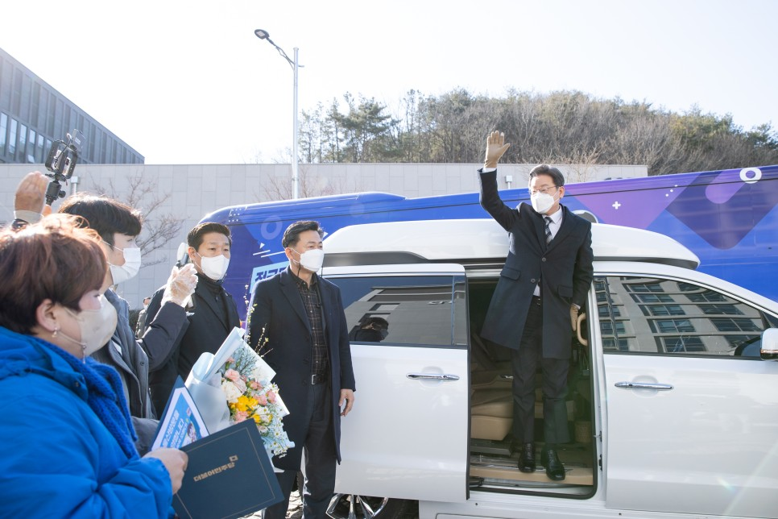

## 지역공약
# 의료체계 구축, 그린에너지산업 선도! 사람이 행복한 도시 울산, 이재명은 합니다!
> 2022-02-06 11:34:09

존경하는 울산시민 여러분!

​

울산은 예로부터 사람 살기 좋은 터전이었습니다. 반구대 암각화부터 천전리 각석, 달천 탄광과 해양무역지 염포까지 울산은 언제나 삶과 산업의 중심지였습니다.

​

현대에 들어서도 울산은 명실상부한 국가기간산업의 중심이었습니다. 1960년대 세계적 규모의 국가산업단지 조성으로 우리나라 중화학공업의 중추적 지위에 오른 울산은 대한민국의 세계 10대 경제대국 진입에 크게 기여했습니다.

​

그러나 이제는 울산이 달라져야만 합니다. 4차산업혁명으로 대전환이 급격히 진행되면서 산업도시 울산에 커다란 변화가 요구되고 있습니다. 수도권 과밀화로 인한 국토 불균형이 심각해지면서 울산 역시 인구 유출과 고령화라는 과제를 마주하게 됐습니다.

​

그동안 산업발전과 경제성장을 앞세우는 과정에서 정작 울산시민의 삶의 질에는 소홀하지 않았는지 살펴야 합니다. 산업도시 울산을 넘어 사람이 행복한 도시 울산으로 나아가겠습니다.

​

이를 위한 이재명 정부의 울산 6대 공약을 말씀드립니다.

첫째, 울산시민의 건강과 안전을 지킬 의료체계를 구축하겠습니다.

울산의료원 설립을 조속히 추진해 공공의료기관 비중 1%라는 불명예를 씻어내겠습니다. 감염병 재난과 고령화에 따라 늘어나는 의료수요에 원활하게 대응할 수 있도록 필수보건의료 안전망을 확보해 나가겠습니다.

​

울산대학교는 지역의료 불균형을 해소하기 위해 의대 정원을 배정받았습니다. 울산대 의대 운영을 정상화해서 학생들이 울산에서 의사로 성장할 수 있도록 하겠습니다. 의대 정원도 확대하여 지역의료 불균형을 해소해 나가겠습니다.

둘째, 반구대 암각화가 있는 울산을 세계문화유산 도시로 발전시켜나가겠습니다.

‘세계 최초의 바위 그림’, ‘문화재의 맏형’이란 수식어가 반구대 암각화의 위상을 말해줍니다.

​

반구대 암각화의 학술적 가치는 이미 세계적인 문화유산으로 자리매김한 상태입니다.

​

국가 차원에서 반구대 암각화군의 유네스코 세계유산 등재를 적극 추진하겠습니다.

​

암각화 세계유산센터 유치를 추진하고 암각화군 역사관광 자원화를 준비하기 위한 대곡천 에코지오밸리공원과 둘레길 조성을 추진하겠습니다.

​

반구대 암각화군의 유네스코 세계유산 등재로 울산이 부울경 관광산업의 허브로 도약하게 될 것입니다.

셋째, 산업을 과감히 혁신해 울산의 미래를 준비하겠습니다.

울산을 중화학공업 중심도시로 육성하겠다는 과감한 결단과 의지가 있었기에 울산이 대한민국 산업의 수도와 같은 위용을 갖출 수 있었습니다.

​

그러나 60년이 지난 지금 울산은 다시 기로에 서 있습니다. 새로운 미래를 열어가기 위해서는 또 한 번의 과감한 도전이 필요합니다.

​

탄소중립 제조기술 확보가 기업의 생존을 좌우하는 시대가 왔습니다.

​

그동안 유니스트는 수소에너지, 태양광 에너지, 차세대 원자력 에너지, 탄소 선순환과 같은 연구와 기술개발에 매진해왔습니다.

​

이 같은 연구성과를 산업과 연계시켜 새로운 산업 동력을 만들어가겠습니다.

​

탄소중립기술 실증화를 지원하여 제조산업 거점인 울산을 탄소중립 대응 핵심 거점으로 육성하겠습니다.

​

공정설계기술원 설립을 지원하여 스타트업의 우수기술 공정․설계 과정을 뒷받침하고 스케일업(scale-up)을 돕겠습니다.

​

2024년 개원하는 울산 산재전문 공공병원과 연계해 재활로봇 R&D 연구센터를 설립할 수 있도록 지원하겠습니다.

​

깨끗하게 정비된 공간에 공장과 녹지, 주거지와 상업공간이 어우러진 새로운 개념의 첨단과학 중심 울산밸리 조성을 추진하겠습니다.

​

우수한 기술력을 갖춘 울산과학기술원은 그동안 132개의 창업기업을 배출했습니다. 그러나 아쉽게도 기업의 성장 과정에서 울산을 떠나야 했습니다. 누구나 들어와서 일하며 살고 싶은 곳으로 탈바꿈해야 합니다.

​

영남권 지역 학생과 기술인들에 대한 교육훈련 수요에 부응하고 울산 제조업의 숙련기술이 계승될 수 있도록 숙련기술진흥원 건립을 추진하겠습니다.

넷째, 그린에너지 산업을 선도하는 울산을 만들겠습니다.

울산에 수소 모빌리티 클러스터 구축을 적극 추진하겠습니다.

​

울산은 자동차와 조선 등 전통 모빌리티 산업 기반과 수소 인프라가 우수한 도시입니다.

​

수소 모빌리티 부품기술 지원센터 설립을 포함한 수소 모빌리티 클러스터를 구축해 수소산업 전주기 생태계를 조성하겠습니다.

​

울산이 세계 속에서 수소 산업을 선도할 수 있도록 적극 지원하겠습니다.

​

해상풍력은 에너지전환의 중요한 한 축입니다. 울산 앞바다는 풍부한 바람 자원과 적절한 수심으로 부유식 해상풍력 최적지로 평가되고 있습니다. 조선해양 산업이 발달해 있어 연계산업 육성에도 용이합니다.

​

울산은 부유식 해상풍력을 통해 9GW(기가와트) 전력을 생산하겠다는 계획을 가지고 있습니다. 이를 뒷받침할 연구기반과 풍력발전 전문 제조기업이 밀집한 부유식 해상풍력 제조·연구단지를 조성하겠습니다.

​

다섯째, 소외된 한센인 마을의 환경 개선에 적극 나서겠습니다.

한센인이 모여 사는 성혜마을은 무허가 공장이 난립해 있고 화재와 같은 재난의 위험에 상시 노출돼 있습니다.

​

제대로 된 기반시설도 갖추지 못한 상태입니다. 암을 유발하는 석면 슬레이트가 그대로 드러나 있고 하수시설이 없어 위생 환경은 더욱 열악합니다.

​

그동안 모두가 한센인을 외면하고 방치해온 까닭입니다. 국가가 나서 문제를 해결해야 합니다.

​

장현첨단산업단지와 연계한 지구단위 재정비사업을 지원하겠습니다.

​

70년 넘는 시간 동안 숨죽여 지내 온 한센인 1세대의 평균연령이 80세입니다. 한센인의 안정적 노후생활을 위한 양로주택 건립을 추진하겠습니다.

여섯째, ‘부울경 메가시티’를 통해 국토 균형발전을 이뤄내겠습니다.

균형발전은 지역을 배려하는 문제가 아닌 국가 생존의 문제입니다. 울산과 부산, 그리고 경남을 아우르는 메가시티가 국가 균형발전의 시금석이 될 것입니다. 정부가 부울경 메가시티를 든든하게 뒷받침하겠습니다.

​

울산과 부산․경남을 잇는 교통망을 확충하겠습니다. 울산~양산~김해를 연결하는 동남권 순환광역철도 사업을 신속히 추진하겠습니다. 부산~양산~울산 광역철도의 재정사업 추진을 적극 지원하겠습니다. 수소트램 건설을 지원하여 수소 대중교통의 선도모델을 만들겠습니다.

​

부울경에 수소산업벨트를 구축하여 수소경제의 선도지역으로 육성하겠습니다.

​

찬환경 선박, 자율운항 스마트 선박에 대한 혁신기술 개발과 전문인력 양성을 지원하고 미래차 부품산업 전환을 지원하겠습니다.

​

이로써 부울경을 수도권 못지않은 경쟁력을 갖춘 메가시티로 만들겠습니다.

존경하는 울산시민 여러분!

​

국가적 전환기에 과감한 결단을 통해 위기를 기회로 만들어온 울산입니다.

​

오늘날 대전환을 맞아 다시 한 번 울산의 변화와 도약을 준비해야 합니다.

​

위기를 기회로 바꿔온 저 이재명이 함께 하겠습니다. 산업도시 울산에서 한발 더 나아가 사람이 행복한 도시 울산으로 탈바꿈 시키겠습니다.

​

산업도시로서 쌓아온 기반을 바탕으로 울산의 미래 먹거리를 마련하고 생동감 있고 정의로운 산업전환을 이뤄내겠습니다.

​

의료복지부터 문화관광 자원, 소외된 지역을 품는 일까지 이재명의 꼼꼼한 눈과 발 빠른 실행력으로 챙기겠습니다.

​

의료체계 구축, 그린에너지산업 선도!

사람이 행복한 행복도시 울산, 이재명은 합니다!

고맙습니다.

​

​

​

2022년 2월 5일

​

더불어민주당 제20대 대통령 후보 이재명