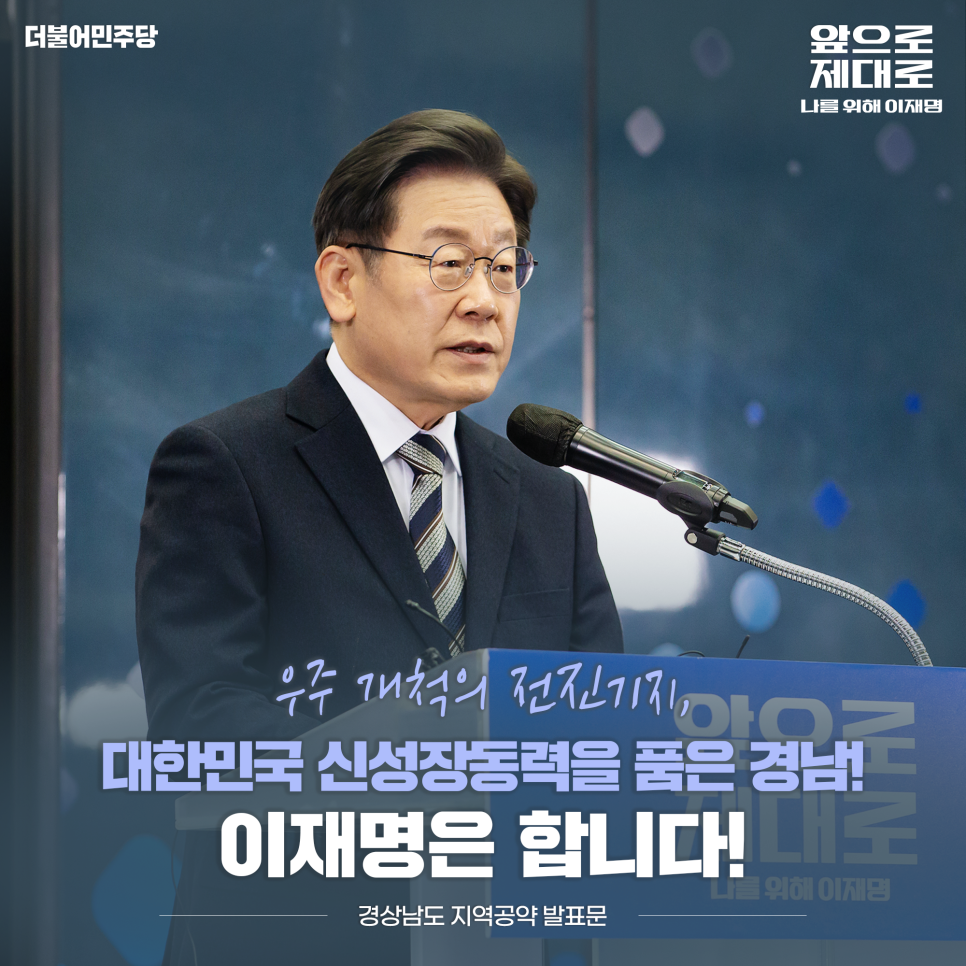

## 지역공약
# 우주 개척의 전진기지, 대한민국 신성장동력을 품은 경남! 이재명은 합니다!
> 2022-02-06 11:42:23

존경하는 경남도민 여러분!

​

2차 세계대전 이후 개발도상국에서 선진국이 된 유일한 나라가 바로 대한민국입니다.

​

일찍이 기계․조선 산업이 발달한 수출자유지역 경남은 전쟁으로 폐허가 된 대한민국을 다시 일으키는 심장이었습니다.

​

대전환의 시대, 대한민국 산업화의 상징이던 경남의 역할을 다시 세우겠습니다.

​

경남을 미래 대한민국의 신성장 동력으로 키우겠습니다. 국방산업에 기초한 항공우주산업의 중심이자 우주 개척의 전진기지로 발돋움시키겠습니다. 풍력산업, 수소산업, 미래자동차 부품산업, 그리고 친환경 조선산업에서 경남의 성장 잠재력을 극대화하겠습니다.

​

지역 간 격차와 불균형을 해소하는 국토 대전환은 이제 국가생존의 문제입니다. 경남과 부산·울산을 아우르는‘부울경 메가시티’가 국토 균형발전의 시금석이 될 것입니다.

​

부울경의 행정과 경제가 유기적으로 융복합하고 1시간대 생활문화권으로 발돋움하도록 만들겠습니다. 나아가 경남을 유라시아와 태평양을 잇는 세계의 경제 관문으로 도약시키겠습니다.

​

이를 실현하기 위한 이재명 정부의 경남 8대 공약을 말씀 드립니다.

첫째, 진해신항 중심의 동북아 물류 플랫폼을 완성하겠습니다.

전 세계 산업이 물류시장 중심으로 재편되고 있습니다. 진해신항은 가덕도 신공항 조성에 힘입어 해운물류를 육상과 항공으로 연계하는 동북아 물류플랫폼으로 새롭게 도약해야 합니다.

​

진해신항이 초대형 선박과 초고속 하역능력을 갖춘 메가포트로 개발되도록 지원하겠습니다. 미래형 배후 물류도시 조성, 글로벌 기업유치, 고부가가치 물류산업 육성을 위한 종합계획을 수립하겠습니다.

둘째, 부울경 메가시티 1시간대 생활권을 실현하겠습니다.

진주에서 울산까지 1시간대 생활권 실현을 위해 준고속열차를 연장 운행하고 광역 급행열차를 신규로 도입하겠습니다.

​

창원~김해~양산~울산을 연결하는 동남권 순환 광역철도 사업을 신속히 추진하고 부산~양산~울산 광역철도의 재정사업 추진을 적극 지원하겠습니다.

​

부울경 주요 거점 간 통합환승체계를 구축해 부울경 시민이 보다 편리하게 대중교통을 이용하도록 하겠습니다.

​

창원에 수소트램 건설을 지원해 미래 수소 대중교통의 선도모델을 만들겠습니다.

​

경남도민의 50년 숙원사업인 남부내륙철도는 임기 내 완공을 목표로 차질 없이 진행하고 경전선 수서행 고속열차 운행을 통해 경남도민이 고속철도를 더 쉽게 이용하도록 하겠습니다.

​

남해안 관광벨트의 새 장을 열어갈 남해~여수 해저터널의 조기 완공을 적극 지원하겠습니다.

셋째, 경남을 항공우주산업의 핵심 거점지역으로 육성하겠습니다.

경남은 국내 항공우주산업 생산액의 65% 이상을 차지하는 핵심 거점입니다.

​

세계 7대 우주강국으로의 도약을 위해 경남을 중심으로 항공우주산업을 육성하고 경남이 항공우주산업의 클러스터가 되도록 강력히 추진하겠습니다.

​

항공산업 생태계 부활을 위해 경남의 항공기 종합정비(MRO)산업과 항공우주산업 경쟁력을 강화하겠습니다.

​

경남에 항공우주 제조혁신타운 조성으로 항공우주 신산업을 개척하고, 산업인력 일자리를 확대하겠습니다.

넷째, 기후위기에 대응하는 경남형 그린산업 경제생태계를 구축하겠습니다.

해상풍력산업, 수소특화단지 조성, 소형모듈원자로 연구개발 추진으로 기후위기 대응 신산업 기반을 구축하겠습니다.

​

중소기업 주도의 해상풍력설비 특화단지를 구축해 경남을 아시아 해상풍력산업의 허브로 만들겠습니다.

​

경남에는 LNG 기지와 같은 수소공급 인프라가 잘 갖춰져 있습니다. 이를 토대로 수소 저장 용기와 액화수소 국산화 기술개발을 위한 경남형 수소특화단지를 조성하겠습니다.

​

소형모듈원자로 연구개발 및 원전 해체기술이 지역 원전산업에 기여할 수 있도록 적극 지원하겠습니다.

다섯째, 경남에 친환경 스마트 선박 클러스터를 조성해 조선산업 세계 1위를 지켜나가겠습니다.

세계 선박시장에서 고부가가치 선박의 비중이 높아지고 기후위기 대응을 위한 친환경 선박의 수요가 증가하고 있습니다. 긴 불황을 견뎌낸 조선 강국 대한민국과 국내 조선산업의 중심 경남의 새로운 기회로 삼아야 합니다.

​

한국형 스마트야드 핵심기술 개발과 전문인력 양성으로 경쟁력을 강화해 조선산업 세계 1위를 지켜내겠습니다.

​

조선산업의 경기순환 과정에서 관련 기업의 폐업과 노동자 실업이 반복되지 않도록 경쟁력과 안전망을 강화하겠습니다.

​

여섯째, 미래자동차 부품산업 전환 지원으로 새로운 성장 기회를 창출하겠습니다.

전 세계가 내연기관 자동차 생산과 판매 중단에 나서고 있습니다. 현대자동차 역시 2040년까지 내연기관 자동차 판매 중단을 선언했습니다.

​

경남의 자동차 부품 관련 사업체 수는 전국 2위입니다. 그 중에서 43%가 내연기관, 동력전달 부품 관련 기업입니다. 미래차 산업으로 신속히 전환해 경남이 자동차 산업 대전환의 중심으로 자리잡도록 하겠습니다.

​

배터리 재자원화, 미래 모빌리티 파워모듈 기술고도화로 새로운 성장 기회를 창출하겠습니다.

​

전환 과정에서 부품기업과 노동자가 소외되지 않도록 정의로운 전환을 체계적으로 추진하겠습니다.

일곱째, 경남에 공공의료 인프라를 확충하겠습니다.

코로나 팬데믹은 촘촘한 공공의료 체계의 필요성을 절감케했습니다. 경남은 공공의료원 폐쇄의 아픔을 겪었기 때문에 누구보다 공공의료의 필요성에 공감할 것입니다.

​

저 이재명은 공공의료원 설립 운동이 좌절되면서 정치입문을 결심했을 만큼 그 중요성을 누구보다 일찍 예견하고 성남시의료원 건립을 추진했습니다.

​

의료 취약지역인 서부경남에 공공병원을 중심으로 출산‧육아, 요양‧돌봄의 통합적 서비스를 포괄하는 서부경남 의료복지타운 조성을 지원하겠습니다. 진주권의 공공의료원 설립에 차질이 없도록 적극 지원하겠습니다.

​

부울경 소아전문응급의료센터 지원을 확대해 소아 환자가 안심하고 진료받을 수 있도록 하겠습니다.

​

여덟째, 가야사가 온전히 재조명받고 가치를 회복하도록 지원하겠습니다.

삼국사 위주의 정책으로 소외되어 온 가야사의 국가문화재 지정과 승격을 추진하겠습니다.

​

박물관 고도화, 문화예술 이음터, 가야 스마트 문화관광권 조성으로 가야 왕성지를 보존하고 관리하는 정비 사업을 차질없이 진행하고 가야 고분군이 세계문화유산에 등재될 수 있도록 적극 지원하겠습니다.

​

정부 차원의 남부권 광역관광개발 사업과 가야사 정비사업으로 가야 문화권을 관광자원화 하겠습니다.

​

존경하는 경남도민 여러분,

​

경남은 지난 10여 년간 지역 주력 산업이 침체하며 참으로 어려운 시기를 보냈습니다. 불황의 사슬을 끊고 경남의 전환을 준비해온 문재인 정부의 노력을 단단히 이어받겠습니다.

​

위기일 때 더욱 큰 능력을 발휘하며 갖은 난관을 돌파해온 저 이재명이 경남의 위기를 기회로 바꾸어 내겠습니다.

​

성남시와 경기도의 공약을 95% 이상 이행한 이재명, 말이 아닌 실천으로 유능함을 증명해온 이재명에게 맡기면 정말로 국민의 삶이 달라진다는 것을 경남도민 여러분께 보여드리겠습니다.

​

우주 개척의 전진기지,

대한민국 신성장동력을 품은 경남!

이재명은 합니다!

​

고맙습니다.

​

​

2022년 2월 5일

​

더불어민주당 제20대 대통령 후보 이 재 명