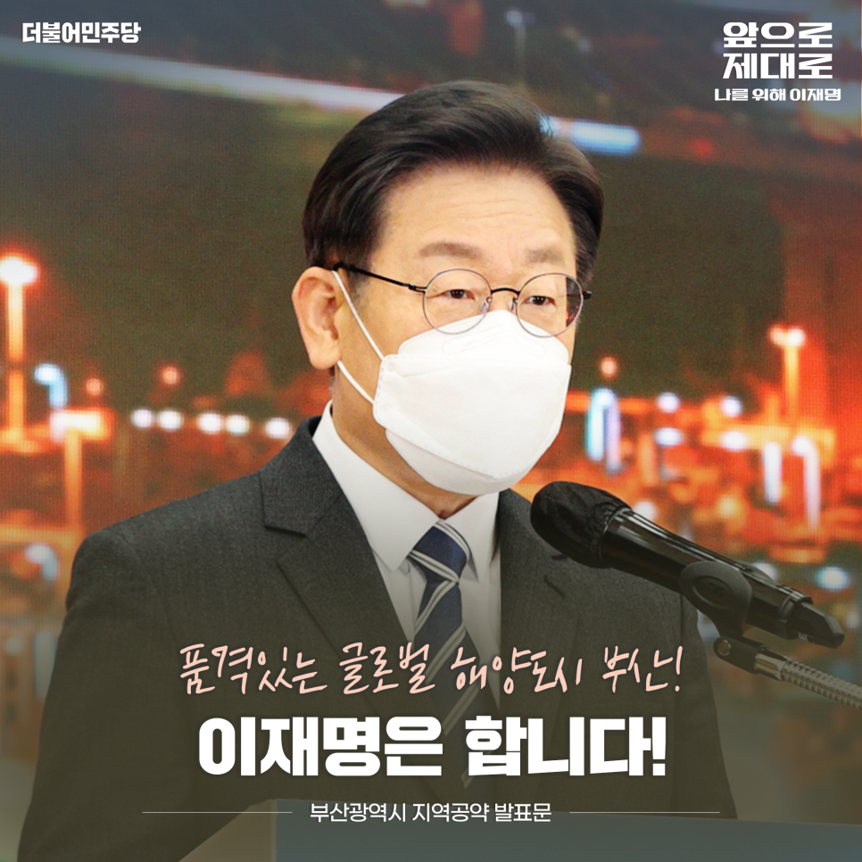
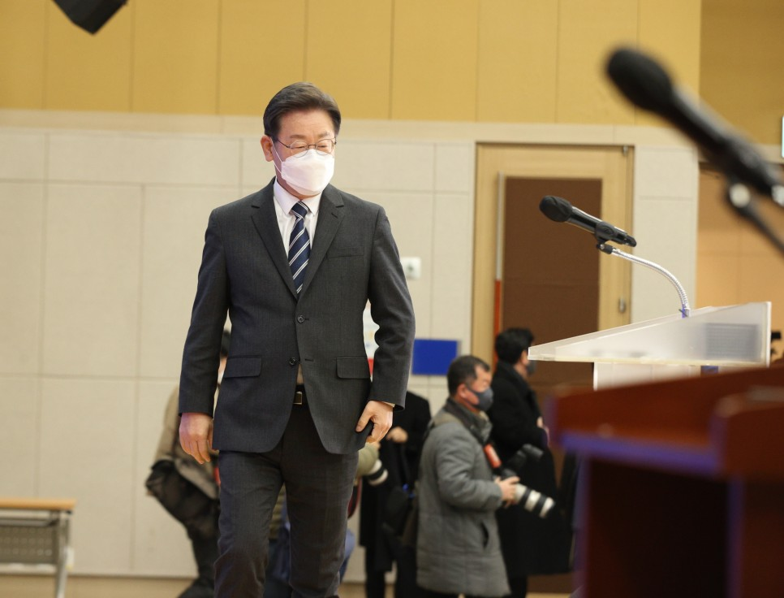
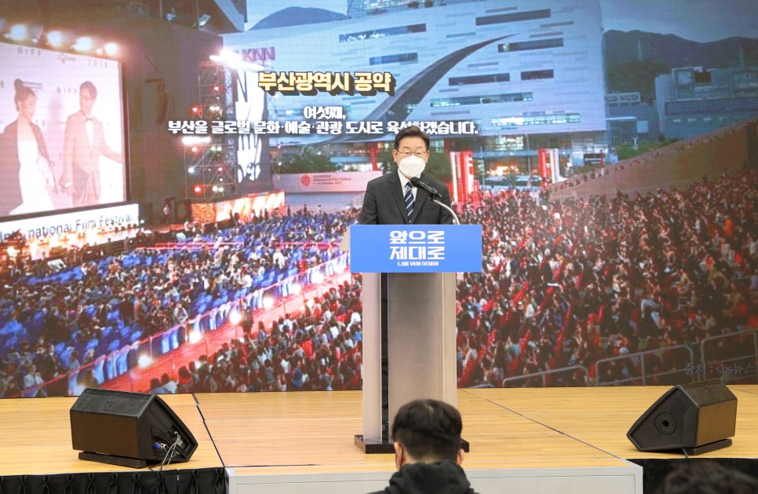
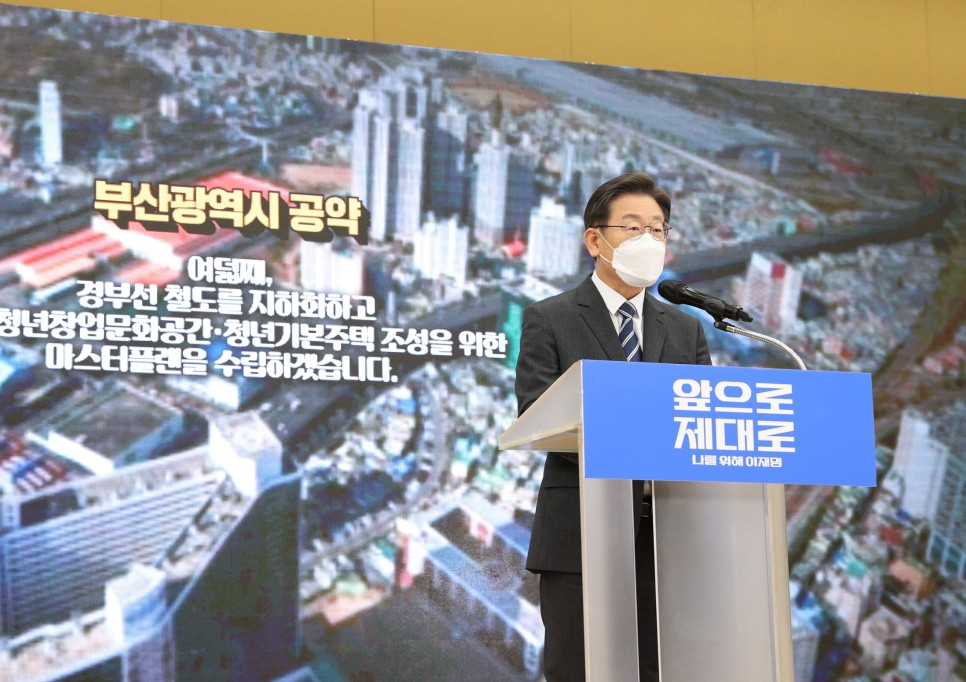
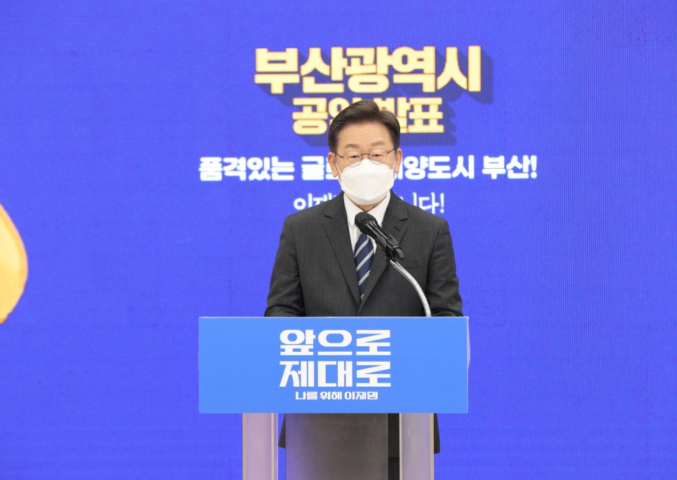
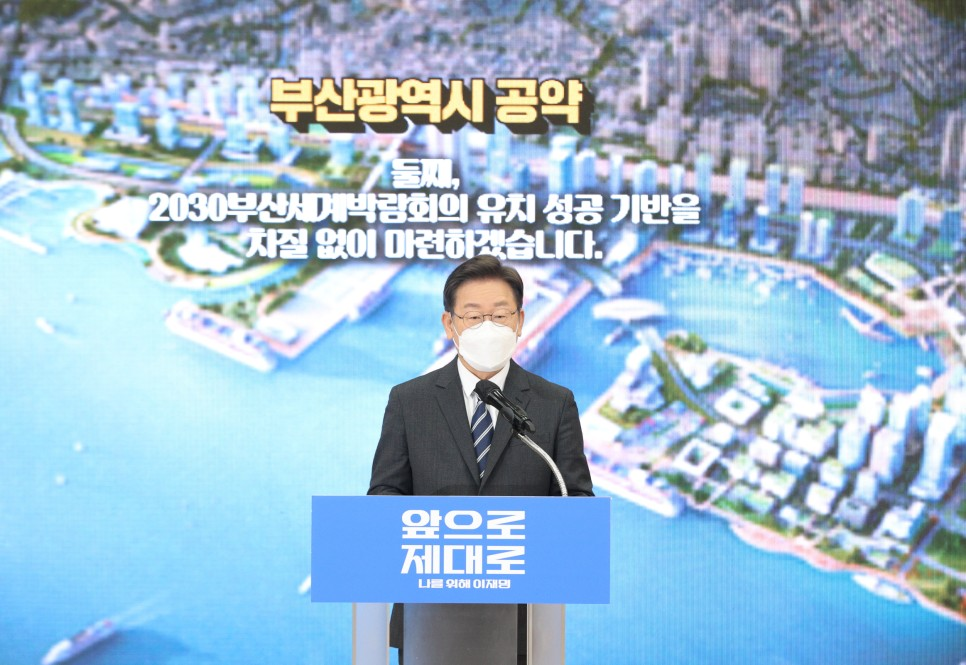
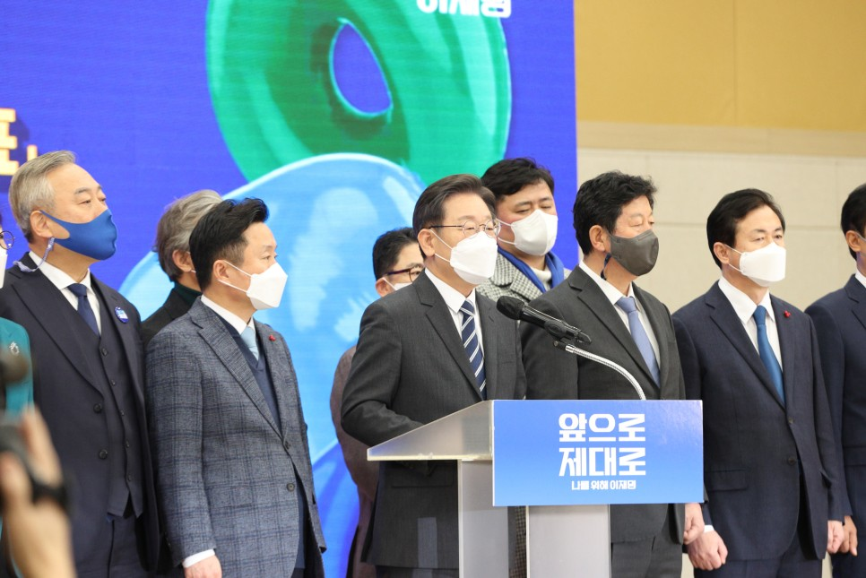
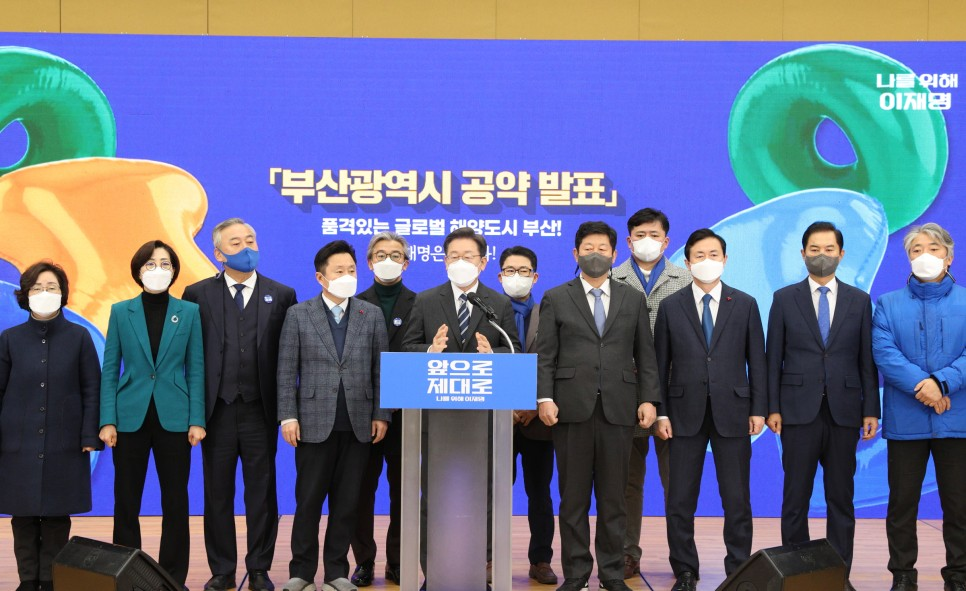
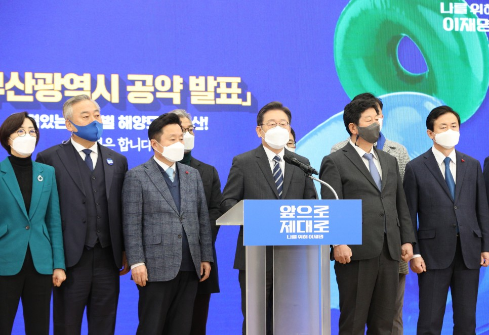
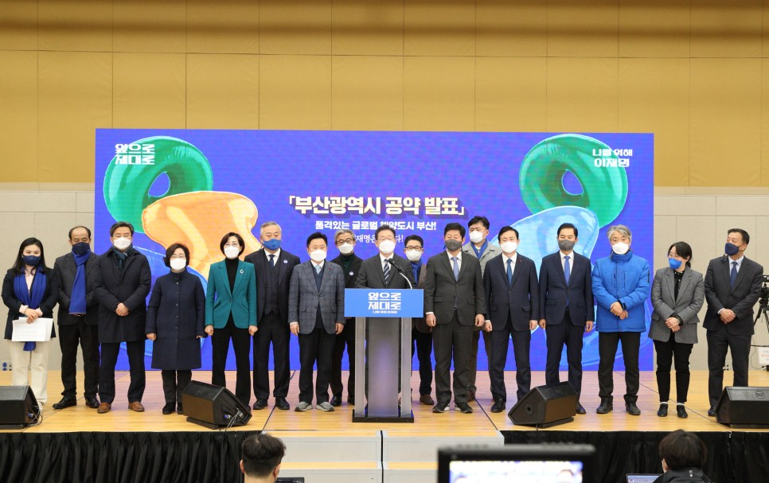

## 지역공약
# 품격있는 글로벌 해양도시 부산! 이재명은 합니다!
> 2022-02-06 14:29:46

존경하는 부산시민 여러분!

​

지난 1월 1일 새해 첫날에 이어 한 달만에 부산에서 다시 인사드립니다.

​

정부의 해운 재건 의지가 담긴 웅장한 HMM(현대상선) 로테르담호의 첫 출항 현장에 함께하며 글로벌 해양도시로서 부산의 의미와 잠재력을 다시금 마음에 새겼습니다.

​

항만을 거점으로 하는 물류의 힘은 대한민국을 선진국으로 도약시킨 원동력입니다. 부산항과 경부선 철도를 따라 전국 방방곡곡을 오간 물류는 대한민국 경제의 혈액이었으며 부산은 그 피를 돌게 하는 심장이었습니다.

​

이제 대전환의 새로운 시대에 발맞춘 부산의 미래를 준비하겠습니다.

​

제2, 제3의 도시가 아니라‘부산’ 그 자체로 세계 속에 우뚝 서도록 하겠습니다.

​

노무현 대통령님이 꿈꾸고 문재인 대통령님이 약속한 부･울･경 메가시티의 중심으로 부산의 위상을 다시 세우겠습니다.

​

부산에서 나고 자란 청년이 부산에서 꿈을 맘껏 펼칠 수 있도록 강력한 국가균형발전 정책을 펼치겠습니다.

​

품격있는 글로벌 해양도시 부산을 완성하기 위한 이재명 정부의 9대 공약을 말씀드리겠습니다.

첫째, 가덕도 신공항을 2029년까지 개항하고 연계 교통망을 확충하겠습니다.

가덕도 신공항이 2029년까지 24시간 운영 가능한 동남권 관문공항으로 개항할 수 있도록 하겠습니다. 오는 3월 완료 예정인 사전타당성조사 이후 예비타당성조사 면제와 기본계획 수립에 곧장 돌입하겠습니다.

​

아울러 건설과 운영의 효율 극대화를 위해 가덕신공항 건설공단, 가덕신공항공사를 적기에 신설하겠습니다.

​

가덕도 신공항, 부산신항, 철도를 연계한 물류 트라이포트를 구축해 부산이 명실상부한 동북아의 물류 허브로 도약할 수 있는 토대를 마련하겠습니다.

​

가덕도 일원에 공항복합도시를 건설하고 조성될 글로벌 물류단지 내에 세계적인 물류기업 유치를 적극 지원하겠습니다.

​

가덕도 신공항을 근거로 하는 저비용항공사(LCC) 유치를 적극 지원해 지역의 여객･항공산업과 상생 발전할 수 있는 환경을 마련하겠습니다.

​

부울경 어디에서나 가덕도 신공항에 닿을 수 있는 GTX급의 철도망을 구축하고 연결도로와 연계 광역교통망 확충을 추진하겠습니다.

둘째, 2030부산세계박람회의 유치 성공 기반을 차질 없이 마련하겠습니다.

지난 1월, 두바이 엑스포장에서 열린‘한국의 날’ 행사에 참석한 문재인 대통령님께서는

​

“2030년 한국의 해양 수도 부산에서 다시 만나‘세계의 대전환’이라는 담대한 항해에 함께하길 희망한다”며 세계박람회 유치 의지를 천명하셨습니다.

​

2030년 세계박람회의 개최지가 결정되는 내년 11월까지 부산의 유치 경쟁력을 극대화하겠습니다.

​

국무총리를 추진위원장으로 선임하고 세계박람회 조사단의 현장 방문 시 제가 직접 영접에 나서겠습니다.

​

개최 예정지인 북항 일원의 통합개발사업을 2030년까지 차질 없이 완료하겠습니다.

​

C-Bay Park(씨-베이 파크)선 트램을 비롯한 저탄소･친환경 대중교통 수단을 확충해 전국 방방곡곡에서 손쉽게 박람회장을 방문하실 수 있도록 만들겠습니다.

​

나아가 정부 차원의 고위급 정책협의체를 구성해 부산시민의 숙원인 미군 55보급창과 8부두 이전에 박차를 가하겠습니다.

​

​

셋째, 부산을 해운산업의 메카로 육성하겠습니다.

해운업계 위기관리와 해운정보 중심의 지식산업 기반 마련을 위한 해운거래소 설립을 적극 지원하겠습니다. 해양 데이터 산업 혁신클러스터를 지정해 부산을 해운정보 산업의 선도주자로 육성하겠습니다.

​

이러한 기반을 바탕으로 HMM(현대상선)과 같은 해운기업 본사를 부산에 유치하겠습니다.

​

지역인재 육성을 위한 부산형 공유대학‘연합해양물류 과정’을 신설하겠습니다. 부산의 인재와 부산의 산업이 동반 성장할 수 있는 환경을 마련하겠습니다.

​

부산항만공사 자율성 확대를 위한 특별법 제정과 부산항만공사를 주축으로 한 글로벌 터미널 운영회사 설립방안을 적극 모색하겠습니다.

넷째, 부산을 수소경제의 허브로 육성하고 부품산업의 친환경 미래산업 전환을 적극 지원하겠습니다.

부울경 수소 산업벨트를 구축해 수소경제권을 실현하겠습니다. 동남권 수소배관망 구축과 같은 주요 사업이 성공적으로 추진되도록 적극 지원하겠습니다.

​

부산신항의 해운항만 컨테이너 물류를 위한 수소 생산․공급 시설을 조속히 구축하겠습니다.

​

통영․울산의 가스저장시설과 부산신항의 벙커링 기지를 연계한 LNG, 수소, 암모니아 에너지 메가 클러스터 조성을 추진하겠습니다.

​

부산의 자동차･선박 부품, 조선기자재와 같은 전통 제조업이 미래차 부품산업과 신재생에너지 산업으로 전환하도록 적극 지원하겠습니다.

​

다섯째, 블록체인 특구를 활성화해서 부산을 핀테크․디지털자산거래의 중심지로 육성하겠습니다.

핀테크 연구단지를 조성하고 지역기업에 디지털 지원을 강화하겠습니다.

​

가상자산의 발행과 거래와 같은 블록체인 생태계 전반을 관리할 수 있는 ‘블록체인진흥원’설립을 지원하겠습니다. 이를 위한 관련 법안이 조속히 통과될 수 있도록 적극 지원하겠습니다.

​

투자자를 보호하고 시장교란 방지를 위한 충분한 안전장치를 마련하겠습니다. 부산시와 가상자산 업계가 협업하여 가상화폐 공개와 증권형 토큰 발행이 활성화될 수 있는 플랫폼 구축을 지원하겠습니다.

여섯째, 부산을 글로벌 문화･예술･관광 도시로 육성하겠습니다.

최근 비대면 문화의 확산으로 OTT, 게임, 웹툰 시장이 급격히 성장하고 있습니다. K-팝에서부터 K-드라마까지 K-컬쳐가 전 세계의 주목을 받고 있습니다.

​

아시아를 넘어 세계적 영화제로서의 위상을 갖춘 부산국제영화제에 대한 국가지원을 체계화하겠습니다.

​

해운대 센텀 영화의전당 일원의 인프라를 정비해 영화와 문화가 어우러진 축제의 장이 되도록 지원하겠습니다.

​

영화․영상뿐만 아니라 부산의 게임․웹툰 산업 인프라를 보다 강화하겠습니다.

​

부산을 거점으로 한 글로벌 투자배급사 육성, 웹툰 산업 발전을 위한 산학관 협력 모델 구축, 게임문화콘텐츠 융복합타운 조성 사업을 적극 지원하겠습니다.

​

아울러 동남권 관광벨트 조성에 박차를 가하고 부울경의 영화․영상 촬영지를 관광 상품화하기 위해 특색있는 관광자원 육성을 지원하겠습니다.

​

부산의 동서균형발전 차원에서 서부산권에 세계적인 전시 공간과 MICE시설 유치를 지원하겠습니다. 낙동강 하구 일원의 ‘제1호 국가도시공원’지정과 조성사업을 적극 지원하겠습니다.

일곱째, 광역교통망 확충으로 부울경 메가시티 1시간 생활권을 실현하겠습니다.

울산~양산~김해를 연결하는 동남권 순환 광역철도사업을 신속하게 추진하고 부산~양산~울산 광역철도의 재정사업 추진을 적극 지원하겠습니다.

​

현재 추진 중인‘하단~녹산선’은 가덕신공항을 비롯해 진해 웅동~경남도청까지 구간 연장을 적극 모색하겠습니다.

​

부산신항~김해 고속도로, 가덕대교~송정IC 고가도로와 같은 광역도로 확충을 신속하게 추진하겠습니다.

​

동해선, 경전선의 기종점이자 부산의 도심과 가덕도 신공항의 연결점이 될 부전역을‘부울경 메가시티 중앙역’으로 강화하고 주변 지역의 종합 개발방안을 마련하겠습니다.

​

이를 통해 동남권 도시 간 통합적인 생활권과 경제권이 형성되고 부산에서 전남․광주까지 이르는 국토 남부권 연계가 획기적으로 강화될 것입니다.

여덟째, 경부선 철도를 지하화하고 숲길·청년창업문화공간·청년기본주택 조성을 위한 마스터플랜을 수립하겠습니다.

경부선 철도는 서울과 부산을 잇는 대한민국 철도의 대동맥입니다. 그러나 경부선은 100년이 넘는 시간 동안 부산을 비롯한 주요 도시들의 도심을 단절시켜 왔습니다.

​

이제 부산의 오랜 단절과 쇠퇴를 해소하겠습니다.

​

‘사람은 지상, 차량은 지하’라는 대원칙 아래 부산 도심을 단절시킨 경부선 철도 구포역~부산진역 구간의 지하화를 추진하겠습니다. 해당 구간의 철도시설을 재배치 하겠습니다.

​

아울러 기존 경부선 철도 구간에 시민과 청년이 일하면서 생활할 수 있는 부산의 미래 공간을 조성하겠습니다. 청년기본주택, 청년창업 문화공간, 숲길을 조성하기 위한 마스터플랜을 수립해 서부산권 재도약의 기회로 삼겠습니다.

아홉째, 부산지역 내 의료격차를 해소하고 공공의료 벨트를 완성하겠습니다.

전례 없는 코로나19 팬데믹을 겪으며, 전 세계는 공공의료 시스템과 보건의료 컨트롤 타워의 중요성을 절감하고 있습니다.

​

현재 부산의 공공의료 시스템은 부산의료원에만 의지하고 있는 열악한 상황입니다. 대한민국 제2의 도시라는 명성과 어울리지 않는 현실입니다.

​

현재 추진 중인 서부산의료원이 적기에 개원할 수 있도록 지원하겠습니다.

​

오랫동안 제 역할을 기다려온 침례병원의 공공병원화를 적극 지원하겠습니다.

​

기존 부산의료원은 지역 내 보건의료 컨트롤 타워 역할을 수행할 수 있도록 기능을 대폭 강화하겠습니다.

존경하는 부산시민 여러분,

​

지방소멸의 위기는 국토의 11.8%에 불과한 수도권에 인구와 자본이 지나치게 집중된 결과입니다.

​

이번 대통령선거는 이 악순환의 고리를 끊고 진정한 국가균형발전을 이루고 대한민국의 새로운 성장동력을 마련할 마지막 기회입니다.

​

대한민국 수출의 심장이었던 부산은 앞으로 미래 세대를 위한 균형발전의 이정표가 되고 지방의 미래가 되고 유라시아~태평양의 새로운 관문이 될 것입니다.

​

오랫동안 부산이 염원해온 가덕도 신공항, 민주당이 해냈습니다. 95% 이상의 공약 이행률을 자랑하는 저 이재명, 앞으로도 국민과의 약속을 천금처럼 지킬 것입니다.

​

언제나 말뿐인 공약들, 반복되는 부산의 묵은 숙제들을 제가 하나씩 해결하겠습니다. 주권자의 대리인이 유능하면 실제로 내 삶이 달라진다는 것을 증명하겠습니다.

​

품격있는 글로벌 해양도시 부산!

이재명은 합니다!

​

고맙습니다.

​

2022년 2월 6일

​

더불어민주당 제20대 대통령 후보 이 재 명