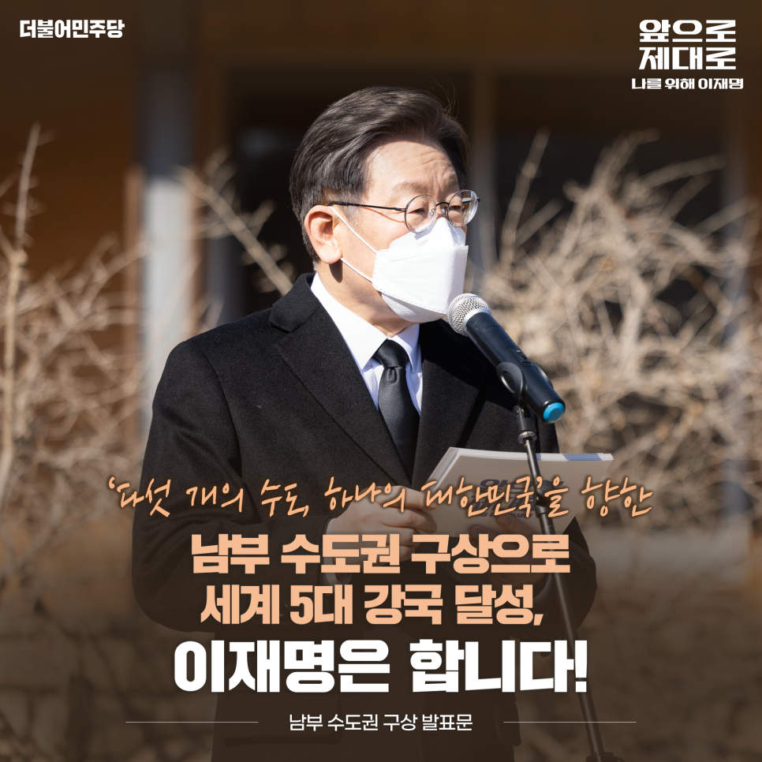
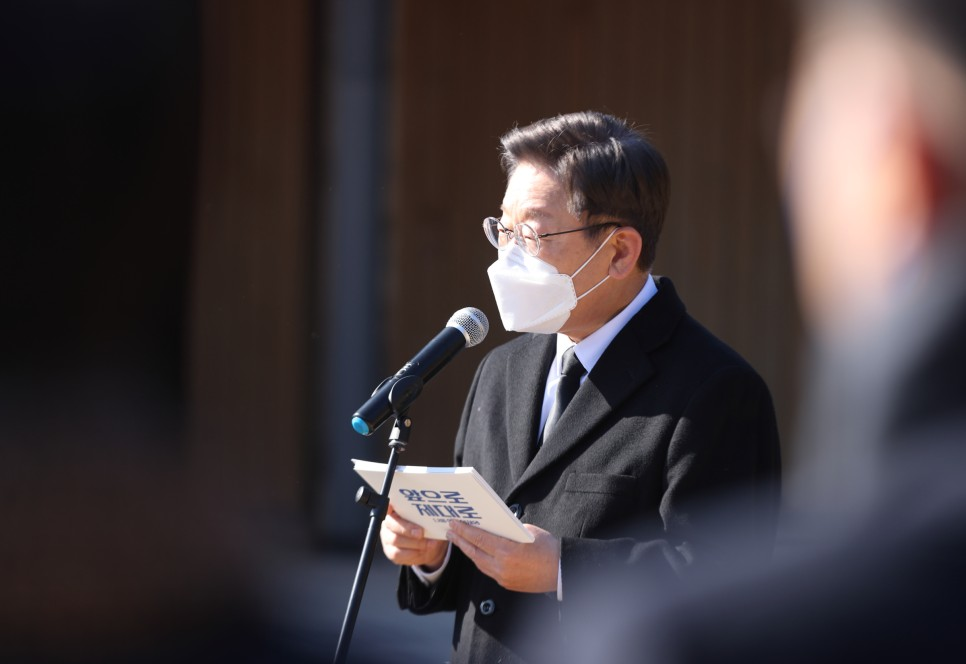
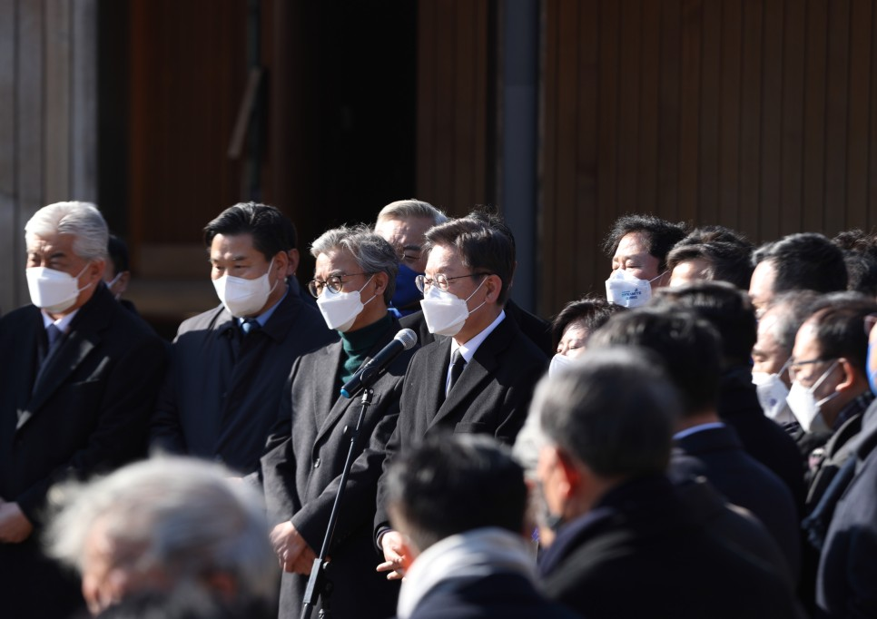
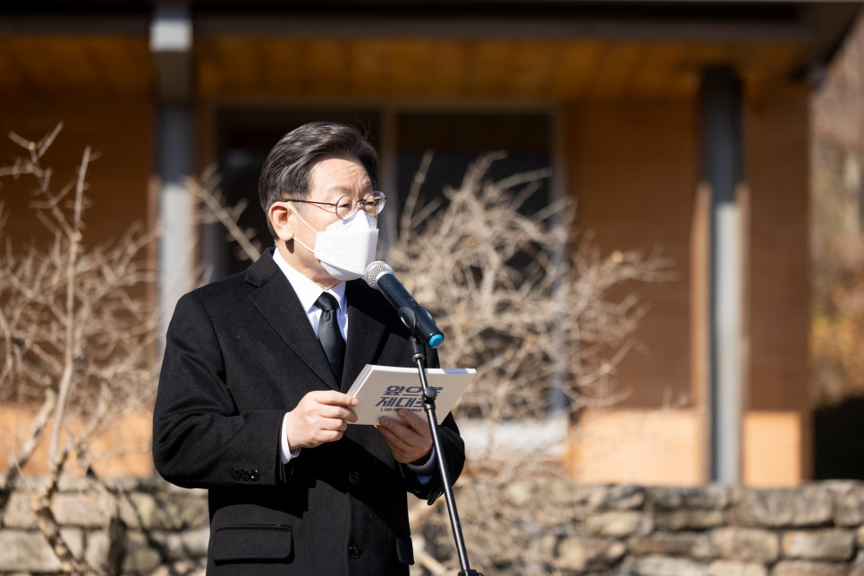
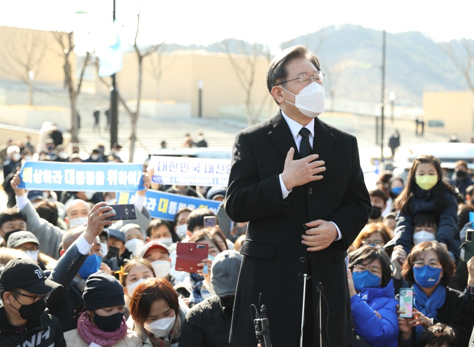
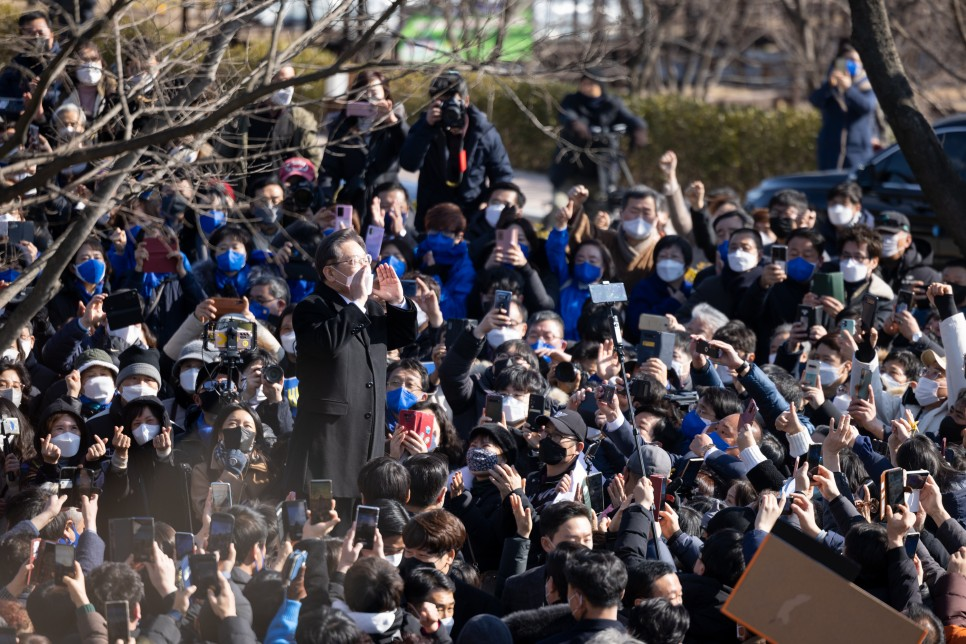
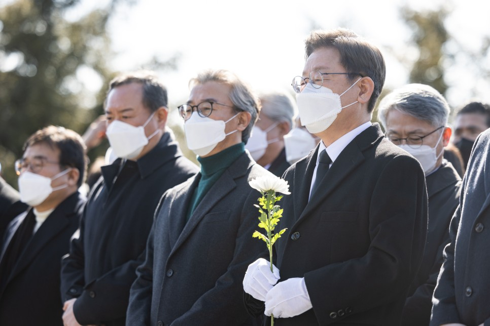
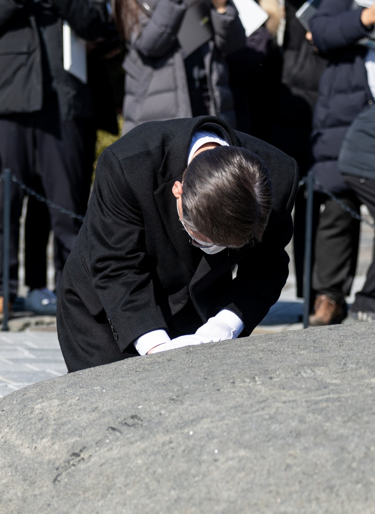

## 대표공약
# ‘다섯 개의 수도, 하나의 대한민국’을 향한 남부 수도권 구상으로 세계 5대 강국 달성, 이재명은 합니다!
> 2022-02-07 11:54:16

대한민국의 수도권 일극 집중체제가 비수도권 지역을 소멸의 위기로 몰아넣고 있습니다. 이 불균형을 방치한다면 국가의 생존마저 위태로울 수 있습니다. 지금 대한민국 정치의 역할이 무엇인지 다시금 되새겨봅니다.

​

누구나 차별 없이 공정한 기회를 누리는 세상, 억울한 사람은 물론 억울한 지역이 없는 나라, 자원과 기회가 효율을 최대로 발휘하는 사회를 만드는 것이야말로 오늘날 국가가 마땅히 해야 할 최우선의 책무입니다.

​

그래야만 대한민국 경제가 지속 성장하고 기회와 희망이 있는 미래로 나아갈 수 있습니다.

​

‘다섯 개의 수도, 하나의 대한민국’을 향한 국토 대전환으로 지금의 위기를 극복해 내겠습니다.

​

이를 실현할 핵심 전략의 하나로 '남부 수도권' 구상을 말씀드리겠습니다.

​

‘남부 수도권’ 구상은 소멸의 위기에 직면한 영·호남권을 다시 돈과 사람이 몰려드는 ‘기회의 땅’으로 만들겠다는 과감한 국토 균형발전 전략이자세계 5대 강국 진입을 위한 대한민국 경제성장 전략입니다.

​

‘다섯 개의 수도, 하나의 대한민국’을 강력하게 추진하기 위해서는‘다섯 개의 수도권’을 ‘2개의 초광역권’으로 묶어 분권형 성장국가로서 시너지를 극대화하는 것이 필수적입니다.

​

수도권과 충청·강원을 묶는 중부권, 영남·호남과 제주를 묶는 남부권을 각각 초광역 단일경제권, 이른바 메가리전(Mega-region)으로 만들겠습니다. 두 개의 초광역권은 대한민국을 세계 5대 강국으로 도약시키는 쌍두마차가 될 것입니다.

세계는 이미 도시와 광역권 경쟁력을 넘어 초광역권 경쟁력이 국가의 경쟁력을 좌우하는 시대로 진입했습니다.

​

발상의 전환, 정부의 의지, 국민적 동의만 있다면 한반도 남부권은 싱가포르와 같이 독자적인 글로벌 초광역 경제권으로 발돋움할 수 있습니다.

​

우리의 잠재력은 이미 확인됐습니다. 남부권은 산업화 시기 경제발전의 주역이었습니다. 다시 대전환 시대의 대한민국 성장동력으로 충분히 발돋움할 수 있습니다.

​

남부 수도권에 싱가포르와 홍콩을 능가하는 글로벌 기준의 선진 기업 환경을 조성하겠습니다. 대만의 산업 경쟁력에 견줄만한 첨단 R&D와 생산 역량을 구축하겠습니다. ‘세계에서 가장 기업하기 좋은 경제구역’으로 재창조해 나가겠습니다.

​

국내 기업은 물론 초일류 글로벌 기업이 서로 앞다투어 찾아오는 곳, 청년이 더 이상 일자리를 찾아 서울로 떠나지 않아도 되는 곳으로 만들겠습니다.

​

정부의 과감한 지원, 민간의 투자 확대, 외국자본의 투자 유치로 남부 수도권에 경제 활력을 불어넣어 현재 1/3 수준인 국가 GDP 대비 규모를 절반 수준까지 끌어올리겠습니다.

​

다음은 남부 수도권 구상의 구체적인 추진 방향입니다.

첫째, 산업과 일자리를 과감하게 지원해 세계적 경쟁력을 갖춘 경제 수도권으로 만들겠습니다.

제도‧재정‧금융을 망라하는 과감한 지원과 남부권 전역을 아우르는 신산업벨트 조성으로 기업이 융성하는 단일 경제권을 조성하겠습니다.

​

남부 수도권의 디지털 대전환, 에너지 대전환을 위해 획기적인 금융 지원을 실시하겠습니다.

​

남부 수도권 투자와 입주 기업에 대한 법인세 추가 감면제 도입, 규제자유특구 전면 확대, 벤처투자 혜택과 같은 기업과 창업에 친화적인 환경을 조성하고 4차산업혁명 시대를 선도하는 창업의 메카로 만들겠습니다.

​

조선, 철강, 기계·장비, 정유 등 기존 산업의 고도화를 통해 글로벌 경쟁력을 확보하겠습니다. 산업인력의 전문화된 교육 훈련, 노동자를 위한 정주여건 강화, 선박펀드와 같은 전문금융펀드의 활성화, 글로벌 시장 개척으로 글로벌 허브국가의 위상을 갖춰 나가겠습니다.

​

다양하게 특화된 미래성장형 산업벨트를 조성하겠습니다. 남부권의 산업생태계를 고도화하고 첨단소재, 항공우주, 수소, 미래모빌리티, 2차전지와 같은 미래산업의 인프라 구축과 제도적 지원을 확대하겠습니다.

둘째, 독립 도시국가에 준하는 혁신 거점도시인 ‘신산업 특화수도’를 2곳 이상 조성하겠습니다.

‘신산업특화수도’는 4차산업혁명 특화 분야에서 세계 시장을 선도할 혁신 거점도시로서 남부 수도권의 성장을 주도하게 될 것입니다.

​

초일류 대학타운 건설, AI·전기차·바이오 등 첨단산업과 고차서비스 발전의 허브가 되도록 지원하겠습니다. 인근 도시와 연계한 메가시티를 조성하여 세계적인 초연결 스마트시티로 대전환을 이루겠습니다.

​

혁신 거점도시의 입지선정은 지방정부와 기업이 주체가 되어 추진하고 지방정부의 신청과 심사를 통해 선정하겠습니다.

​

셋째, 사회기반시설을 확충해 삶의 질을 획기적으로 개선하겠습니다.

남부권의 교육, 의료, 문화 여건을 현 수도권과 견줄 수 있는 수준으로 개선해 청년은 물론 인구와 산업이 모여들도록 만들겠습니다.

​

세계적 수준의 개방형 R&D 센터를 건립하고 국내외 초일류 대학의 컨소시엄과 융합하는 연구중심 대학도시 건설을 추진하겠습니다.

​

남부권 국립대학의 연합체제를 구축하고 국립대학과 사립대학의 연계를 강화해 남부권 전역을 아우르는 인재 양성 시스템을 구축하겠습니다.

​

최고 수준의 의료기관을 유치·설립하겠습니다. 특히 중증질환 중심의 4차 의료기관을 건립해 최우수 의료진을 유치하겠습니다.

2차·3차 의료기관과 연계를 강화해 최고의 의료 서비스를 제공하겠습니다.

​

남부 수도권의 양대 축인 영남과 호남을 연결하는 동서고속철도(HRT)와 고속도로를 건설해 남부권 전역을 2시간대 생활권으로 묶겠습니다.

넷째, 서울 수도권의 새로운 비전과 전략 수립을 병행하겠습니다.

서울을 중심으로 한 또 하나의 초광역권인 중부 수도권 역시 글로벌 경쟁력을 더욱 강화하고 시민의 삶의 질을 획기적으로 높이는 새로운 비전과 전략 수립을 병행해 갈 것입니다.

​

존경하는 국민 여러분,

​

수도권은 과밀화로 숨조차 쉴 수 없고 지역은 소멸의 위기에 처했습니다.

균형발전 성장을 위한 국토 대전환은 더 이상 지역을 위한 배려도 시혜도 아닙니다. 국가의 생존과 지속적인 성장을 위해 피할 수 없는 핵심 과제입니다.

​

이제 대한민국의 지도에는 두 개의 커다란 수도권이 자리 잡게 될 것입니다. 남부 수도권을 성공적으로 부흥시켜 수도권 외바퀴였던 경제를 중부권과 남부권이 함께 발전하는 두 바퀴 경제로 반드시 바꾸겠습니다.

​

세계에서 가장 기업하기 좋은 곳, 대륙과 해양의 출발지이자 종착지인 남부 수도권을 싱가포르를 능가하는 국제금융과 무역, 미래형 첨단산업의 허브로 재탄생시키겠습니다.

​

남부 수도권은 또 하나의 성장 엔진으로서 중부 수도권과 상호 보완하고 또 협력하며 글로벌 경쟁에 나설 것입니다.

​

김대중 정부가 ‘수도권 동북아 중심 구상’으로 글로벌 선도국가로 비상할 초석을 만들었다면 노무현 정부는 ‘충청권 행정수도’로 국토 균형발전과 자치분권의 길을 열었습니다.

​

저 이재명은 두 분 대통령님의 뜻을 창조적으로 계승해 ‘남부 수도권’이라는 비전을 완성하고 대한민국을 세계 5대 강국의 반열에 올려놓겠습니다.

​

기회를 기회로 활용하지 못하는 건 무능한 것이고, 기회를 기회로 활용하는 것은 평범한 것입니다. 위기를 극복하고 기회로 만들어 재도약의 토대를 만드는 것이 진짜 실력입니다.

​

국민에게 한 약속을 95%이상 지키면서 실력을 실적으로 입증해 온 저 이재명이 대한민국을 기회가 넘치는 희망의 나라로 만들겠습니다.

​

‘다섯 개의 수도, 하나의 대한민국’을 향한 남부 수도권 구상으로 세계 5대 강국 달성, 이재명은 합니다!

​

고맙습니다.

​

​

2022년 2월 6일

​

더불어민주당 제20대 대통령 후보 이재명