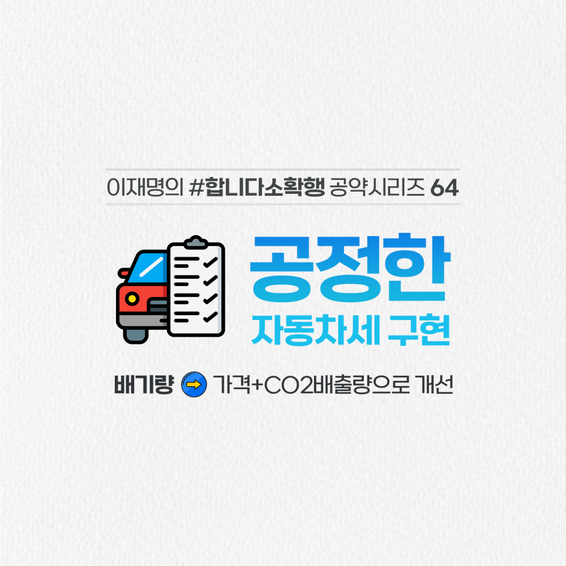

## 소확행 시리즈
# 탄소절감을 위한 공정한 자동차세 부과 체계, 제대로 만들겠습니다
> 2022-02-07 14:09:33

많은 국민들이 배기량 기준의 현행 자동차세 부과체계를 불공정하다고 느낍니다.

​

일례로 차량 가격이 3,500만원인 국내 H사의 3,342㏄ 자동차세는 87만원이지만, 유럽 P사의 1억4,400만 원짜리 2,894㏄ 차량의 자동차세는 75만원에 불과합니다.

​

정작 유럽은 탄소절감을 위해 이산화탄소 배출량을 기준으로 부과하고 있습니다.

​

배기량 기준 자동차세 부과 체계를 가격과 CO2 배출 기준으로 바꾸겠습니다.

​

첫째, 가격에 비례해 자동차세를 부과하되, 소형차와 전기•수소차 세금이 지금보다 늘지 않도록 설계하겠습니다.

​

둘째, CO2 배출량을 반영하는 방식은 배출량 측정 설비가 충분히 신뢰성을 갖추는 대로 시행하겠습니다.

​

탄소절감을 위한 공정한 자동차세 부과 체계, 제대로 만들겠습니다.