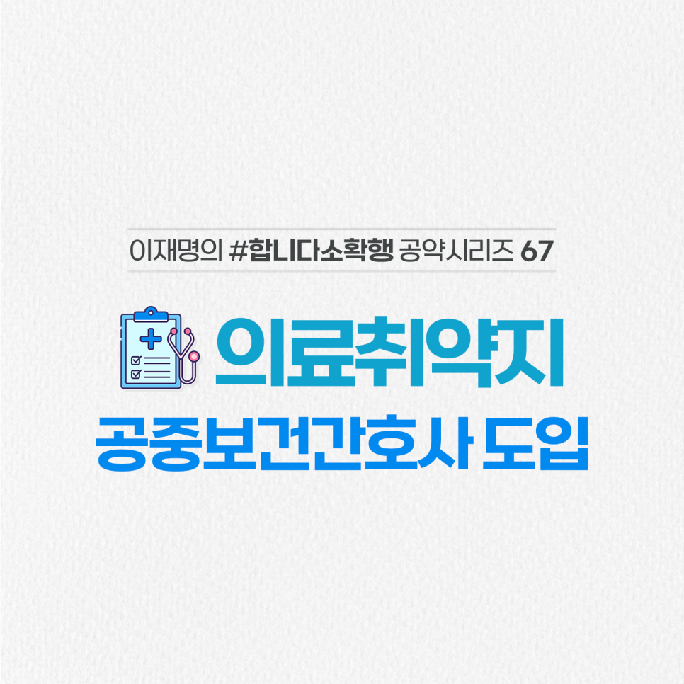

## 소확행 시리즈
# 공중보건간호사 도입으로 의료불균형 해소와 공공의료 강화
> 2022-02-10 09:09:32

의사, 치과의사, 한의사들은 공중보건의사로 병역을 대체하면서, 의료취약지역의 의료기관, 보건소 등에서 공공의료의 공백을 훌륭하게 메우고 있습니다.

​

반면에 전국의 공공의료기관과 보건소 상당수가 심각한 간호사 부족에 시달리고 있지만 간호사를 대상으로 한 대체복무제도는 없습니다.

​

의사나 한의사처럼 도입을 추진하겠습니다.

​

전국 간호학과에 재학 중인 2만 5000명이 일반 사병 복무 대신 면허를 취득하고 관련 기관에 복무함으로서 전문성 향상에도 큰 도움이 될 것입니다.

​

지역간 의료불균형 해소, 의료취약지의 공공의료의 질 또한 크게 향상될 것입니다.

​

관련 법이 조속히 국회를 통과하도록 노력하겠습니다.