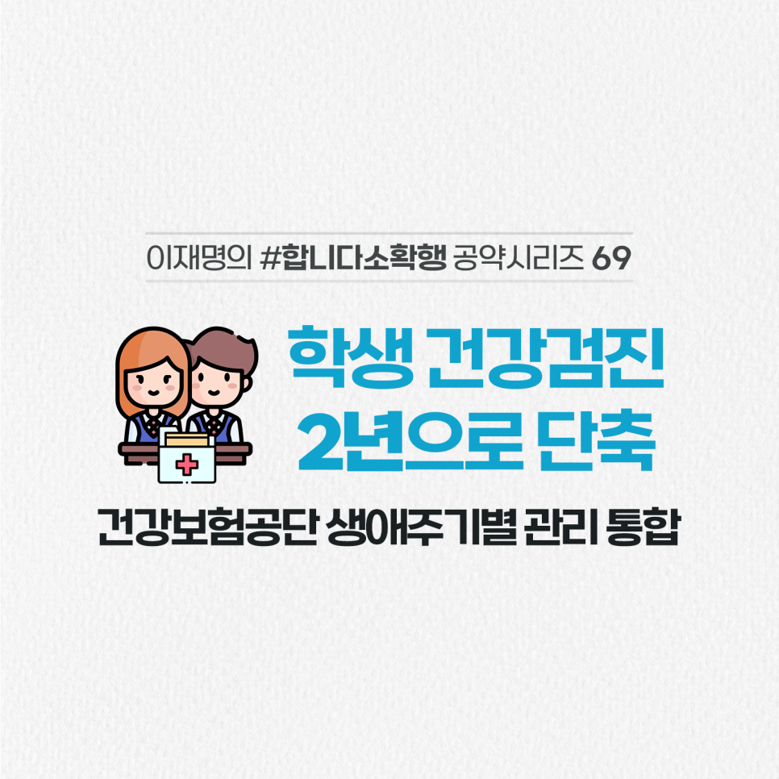

## 소확행 시리즈
# 학생 건강검진 2년으로 단축! 건강보험공단 생애주기별 관리 통합
> 2022-02-11 17:46:33

청소년들은 만6세 미만 영유아나 성인과 달리 3년에 한 번씩 건강검진을 받습니다.

​

국민건강보험 생애주기별 관리체계에도 포함돼 있지 않아 건강 데이터의 관리, 활용도 어렵습니다.

​

성장기 청소년의 건강을 더 꼼꼼히 챙기고 국가가 전생애에 걸쳐 국민 건강을 돌볼 수 있도록 바꾸겠습니다.

​

첫째, 학생 건강검진 주기를 성인과 같이 2년에 1회로 바꾸겠습니다.

​

건강검진 사각지대에 놓인 학교 밖 청소년도 학교 안 청소년과 동일하게 적용하겠습니다.

​

둘째, 국민건강보험공단의 생애주기별 건강검진 체계로 편입하고 전생애에 걸쳐 체계적으로 관리하겠습니다.