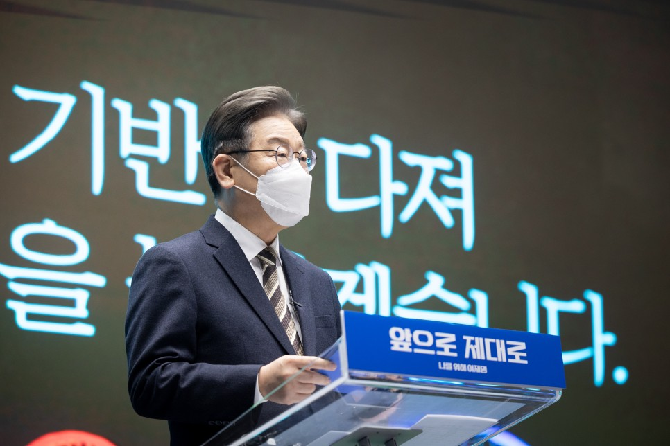
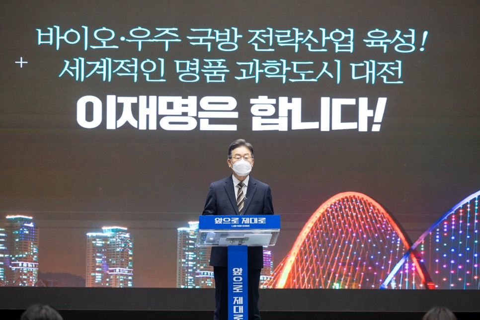
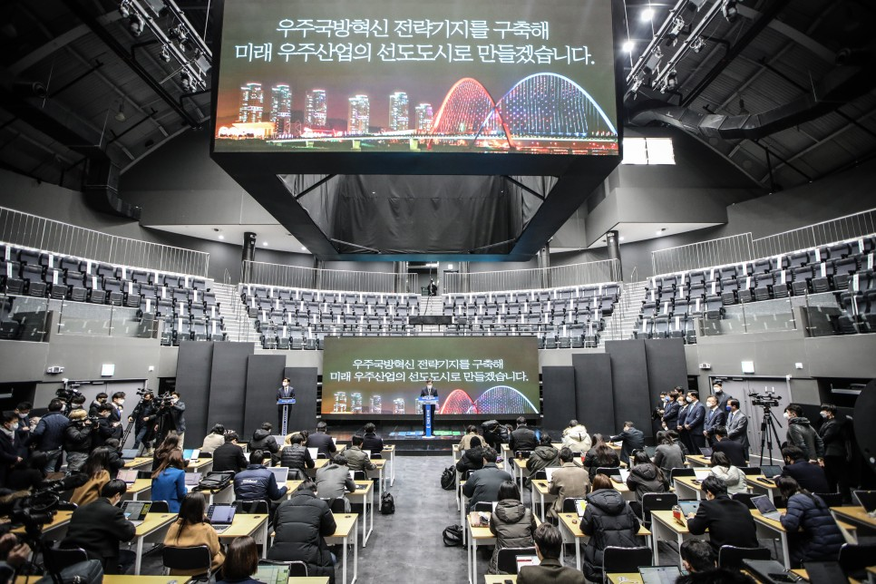
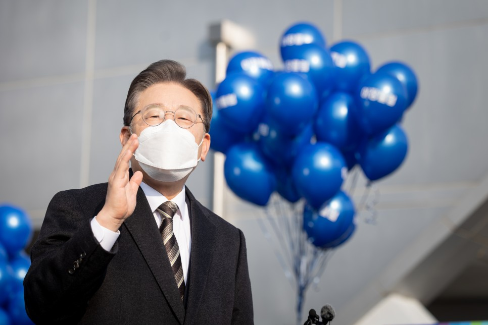
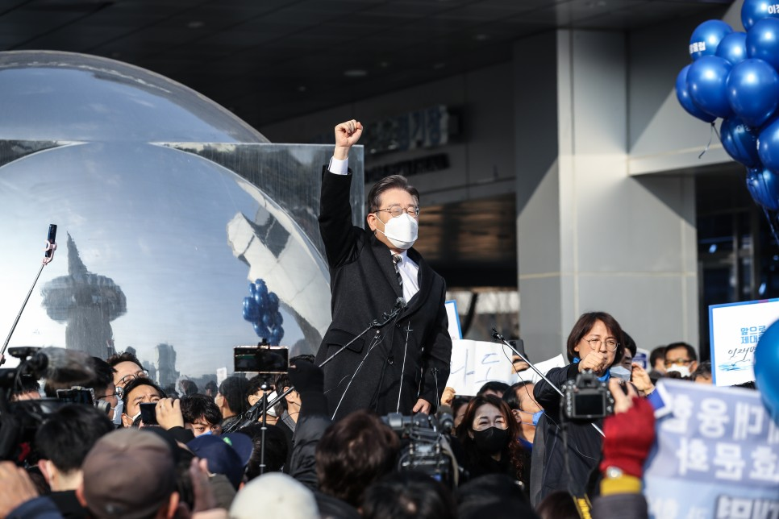
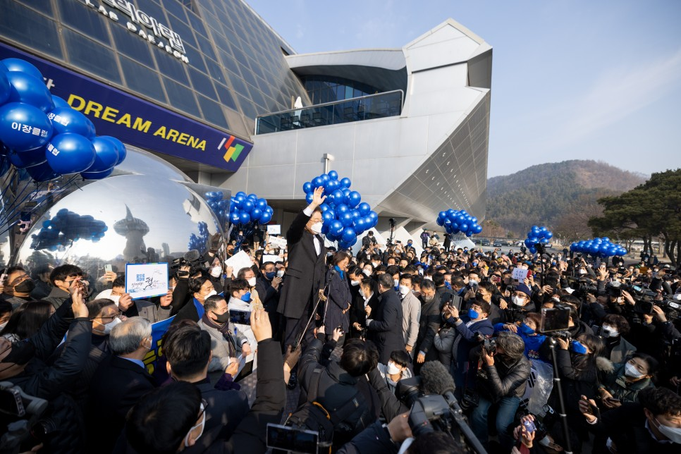

## 지역공약
# 바이오·우주국방 전략산업 육성! 세계적인 명품 과학도시 대전, 이재명은 합니다!
> 2022-02-12 11:56:00

존경하는 대전시민 여러분,

​

하루가 다르게 변화하는 대전환의 시기입니다. 세계는 기술패권을 놓고 치열하게 경쟁하고 있습니다. 과학기술 경쟁력이 국가의 미래를 좌우하게 될 것입니다.

​

과학기술 없이는 대한민국의 미래 경제도 없습니다. 그렇기에 대한민국 과학기술의 심장, 대전의 비전이 중요합니다.

​

바이오산업과 우주국방 전략산업을 키워 과학도시 대전의 경쟁력을 강화하겠습니다. 4차 산업과 디지털 대전환 시대에 발맞춰 대한민국을 이끌어갈 새로운 동력으로 세계적인 명품 과학도시 대전을 만들겠습니다.

​

이미 확정된 대전혁신도시에 공공기관 이전을 조속히 추진해 대한민국 균형발전의 기틀을 닦겠습니다.

​

이를 위한 이재명 정부의 대전광역시 7대 공약을 말씀드리겠습니다.

첫째, 대덕특구 재창조 사업을 추진하겠습니다.

대한민국 과학기술 발전을 이끌어온 대덕특구가 조성된 지 반세기가 흘렀습니다.

4차 산업혁명과 디지털 대전환을 선도하기 위해 대덕특구의 재도약이 필요합니다.

​

창의적인 인재와 혁신의 주체가 서로 연결되는 개방형 생태계를 조성하고 스마트 협업 공간을 갖춰 세계적 혁신 클러스터로의 도약을 추진하겠습니다.

​

창업타운과 창업거리를 조성하고 기술 융복합 플랫폼을 구축하겠습니다. 충청권 첨단 신기술 실증단지를 조성해 규제로부터 자유로운 기술창업의 중심으로 만들겠습니다.

​

대전을 세계 첨단산업 창업이 활발하게 일어나는 거점으로 만들고 에너지 혁신을 통해 탄소중립도시가 되도록 하겠습니다.

둘째, 바이오에 특화된 창업 기반을 다져 바이오산업 글로벌 경쟁력을 높이겠습니다.

대전은 인프라와 인력이 집적된 R&D 주도형 클러스터로 바이오 분야의 창업 역량이 높은 지역입니다.

​

바이오헬스산업을 선도할 수 있도록 대전과 인접 지역의 자원을 연계해 바이오 특화 창업 기반을 구축하겠습니다.

​

지난해 ‘K-바이오 랩허브’ 후보지가 다른 지역으로 결정되면서 대전시민의 실망이 크다는 것을 잘 알고 있습니다. 이에 상응하는 바이오 파운드리 인프라를 대전에 구축하겠습니다.

​

바이오 파운드리는 바이오 연구의 오랜 난제인 속도와 스케일, 불확실성의 한계를 극복함으로써 바이오 기술의 산업화를 가속화할 수 있는 바이오 공정의 혁신 플랫폼입니다.

​

핵심 기반기술을 개발하여 해외 기업이 독점하고 있는 바이오 연구 하드웨어와 소프트웨어의 국산화를 이루겠습니다.

​

바이오소재 개발 속도와 효율을 획기적으로 개선해 사업화 기회를 확대하겠습니다. 대전을 중심으로 융복합 바이오산업의 혁신성장을 선도하고 글로벌 경쟁력을 강화하겠습니다.

셋째, 대전에 우주국방혁신 전략기지를 구축해 미래 우주산업의 선도도시로 만들겠습니다.

최근 순수 국내 기술로 개발한 한국형발사체가 성공적으로 발사되면서 대한민국의 우주시대 준비가 본격화되었습니다.

​

대전은 우주시대 개막의 중심에 서 있습니다. 항공우주연구원, 국방과학연구원, KAIST, 민간의 대규모 연구소와 방산기업과 같은 압도적인 인프라를 보유하고 있습니다.

​

대전과 세종의 방위산업 R&D 역량과 논산과 계룡의 군 역량을 연계하여 대전 일대를 국가 주력 우주개발의 선도지역으로 만들겠습니다.

​

항공우주와 방위산업의 혁신생태계를 조성해 대전을 신소재․통신․정밀제어와 같은 다양한 항공우주 분야 연구개발의 허브로 만들겠습니다. 나아가 미래 방위산업의 전략기지로 성장시켜서 미래형 일자리를 만들어 낼 것입니다.

넷째, 보훈가족을 위한 호국보훈 파크를 조성해 문화와 치유의 열린 공간으로 만들겠습니다.

대전은 서울 이외에 국립 현충원이 있는 유일한 도시입니다.

​

대전 현충원은 아픈 역사를 품은 엄숙한 추모의 공간이자 닫힌 공간이었습니다. 앞으로는 대전 현충원을 보훈가족과 시민들이 편하게 찾아가 쉴 수 있는 열린 공간으로 만들겠습니다.

​

메모리얼 광장 건립과 함께 ICT 체험 기념관과 메타버스 추모관 건립을 추진하겠습니다.

​

군 휴양 시설과 유성온천과 같은 기존 시설을 적극 활용해 중부권의 대표적인 기념공원으로 조성하겠습니다.

​

역사 관광 프로그램을 개발해 국민 누구나 찾는 대표 관광자원으로 만들겠습니다.

​

동구 산내에는 ‘세상에서 가장 긴 무덤’이라고 불리는 골룡골 민간인 집단 희생지가 있습니다. 골룡골에 추진 중인 평화공원 조성 사업을 적극 지원해 희생자 유가족을 위로하고 과거사 치유와 극복의 장으로 만들어 국민 화합에 힘쓰겠습니다.

다섯째, 경부선․호남선 철도를 지하화하고 대전조차장에 레일스카이 복합단지를 조성하겠습니다.

대전은 일찍이 경부선 대전역, 호남선 서대전역이 들어서면서 철도와 함께 성장한 철도의 도시입니다.

​

하지만 도시가 급격히 팽창하면서 철도가 도심을 가로지르는 문제에 직면했습니다. 대전을 삼등분하는 두 철도로 도시 공간 활용에 막대한 제약이 생겼고 철로 주변 주민의 삶의 질이 소음, 진동, 분진으로 열악해졌습니다.

​

도심을 통과하는 경부선과 호남선의 일부 구간을 지하화하여 도시 공간을 재배치하는 방안을 적극 모색하겠습니다. 기능이 축소된 조차장 부지에는

공공주택 중심의 레일스카이 복합단지를 조성해 주택 수요를 충족시키고 낙후 도심지역 활성화와 지역균형발전을 도모하겠습니다.

​여섯째, 충청권 광역교통망을 조기에 구축해 충청권 메가시티의 상생 발전을 추진하겠습니다.

지역의 생존은 물론 국가 균형발전을 위해 초광역 협력은 거스를 수 없는 시대적 과제입니다.

​

대전을 포함한 충청권 4개 시․도가 추진하고 있는 초광역 메가시티를 제대로 완성하기 위해서는 세계의 도시들과 경쟁할 수 있는 규모의 경제를 확보하고 1시간 이내의 광역 생활권을 만들어야 합니다.

​

대전을 중심으로 세종과 충남 계룡, 충북 옥천을 잇는‘대전~세종 간 제2순환고속도로’와‘대전~세종~충북 광역철도’를 조기에 구축하겠습니다.

​

호남고속도로 회덕JCT에서 서대전JCT 구간의 지선을 확장해 만성적인 교통 정체를 해소하겠습니다.

​

‘보령~대전~보은 간 고속도로’건설을 추진해 광역 경제․생활․문화권을 형성하고 충청권의 동반성장을 이뤄내겠습니다.

​일곱째, 청 단위 중앙행정기관을 대전으로 이전해 국가 균형발전을 완성하겠습니다.

1990년 ‘청 단위 중앙행정기관의 지방 이전 계획’에 따라 대전에 정부 대전청사가 들어섰습니다. 이후 약 30년간 대전의 발전과 함께 해온 중소기업청이 중소벤처기업부로 승격하면서 세종시로 이전하게 됐습니다.

​

중기부 이전에 따른 대안으로 기상청과 한국기상산업기술원 등 4개 기관의 대전 이전이 신속히 추진되도록 노력하겠습니다.

​

청 단위 국가기관의 대전 집결원칙을 지키며 이전이 확정된 기관의 조속한 이전을 추진하겠습니다.

​

존경하는 대전시민 여러분!

​

국가 균형발전은 더 이상 늦출 수 없는 최우선 국가과제입니다.

​

김대중 정부는 대덕연구단지와 정부 대전청사를 포괄하는 대덕 밸리를 조성하며 균형발전의 문을 열었습니다. 노무현 정부는 대전의 신행정수도 이전을 추진했고 문재인 정부는 대전을 4차 산업혁명 특별시로 선언했습니다.

​

충청의 사위, 저 이재명은 민주정부 세 분 대통령의 의지가 담긴 국가 균형발전을 제대로 완성하겠습니다.

​

대덕특구의 연구개발이 일자리 창출과 혁신 창업으로 이어져 대전이 전환적 성장의 거점이 될 수 있도록 하겠습니다. 대전을 ‘4차 산업혁명 특별시’로 만들어가겠다는 민주정부의 계획을 중단 없이 추진하겠습니다.

​

바이오·우주국방 전략산업 육성!

세계적인 명품 과학도시 대전,

이재명은 합니다!

​

고맙습니다.

​

​

2022년 2월 12일

​

제20대 대통령선거 더불어민주당 후보 이 재 명