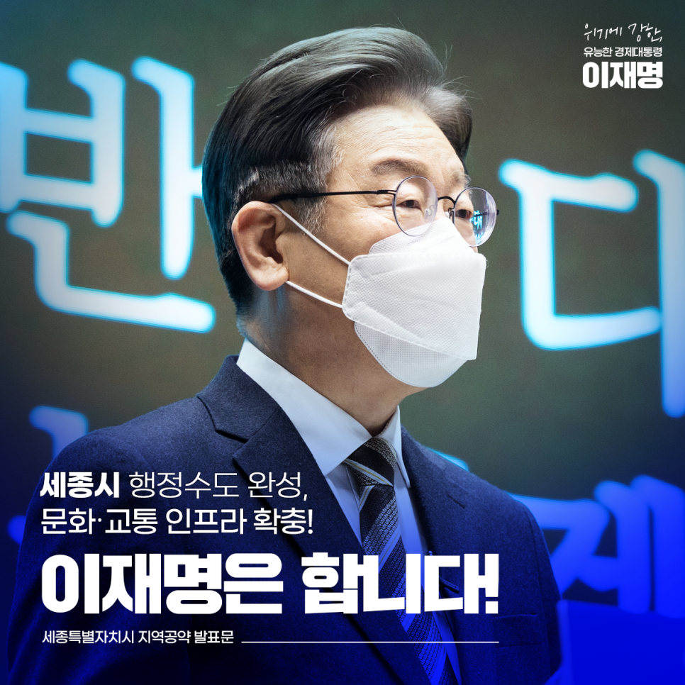
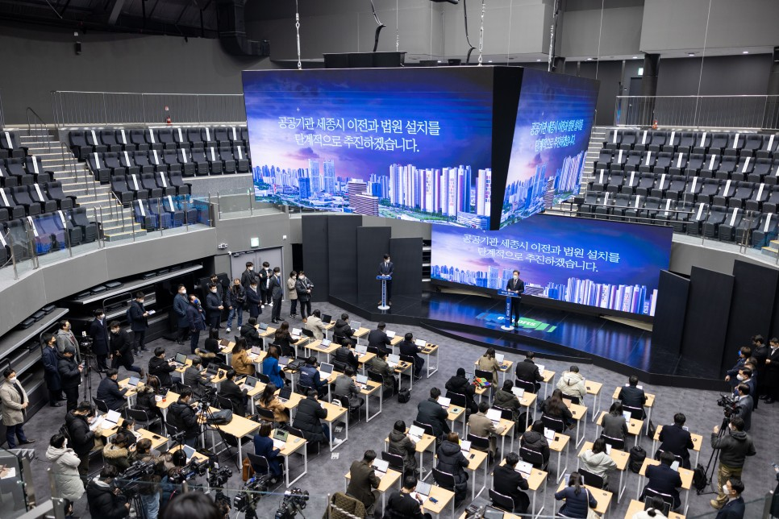
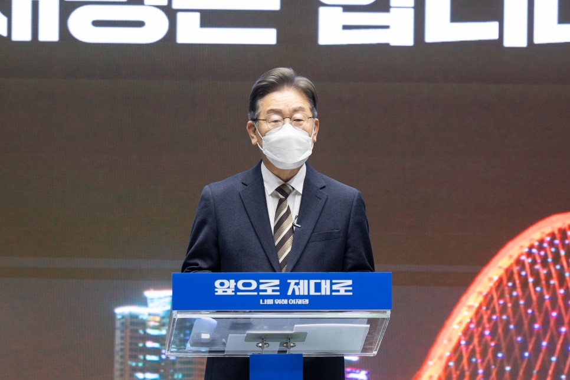
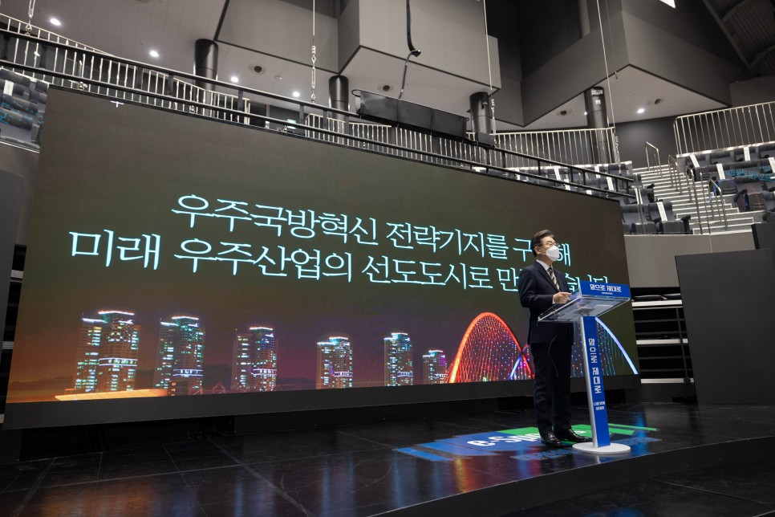
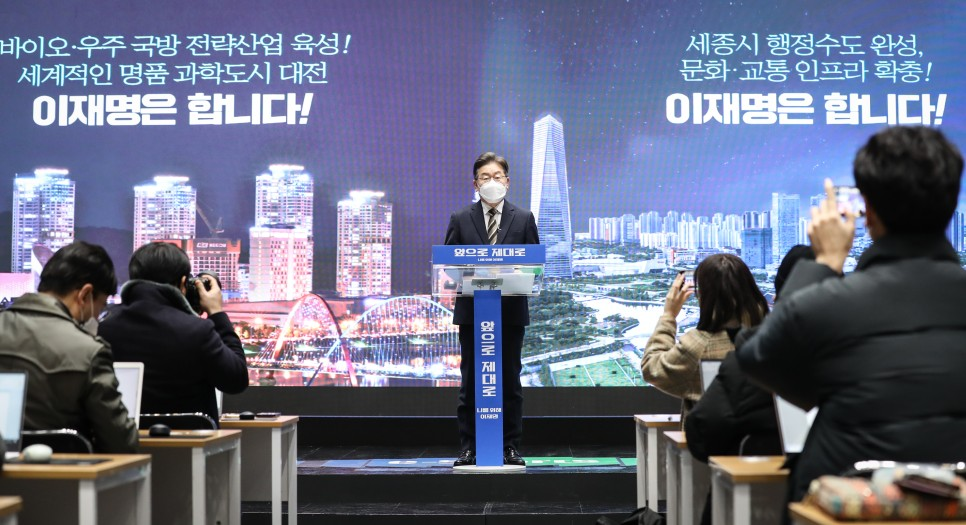
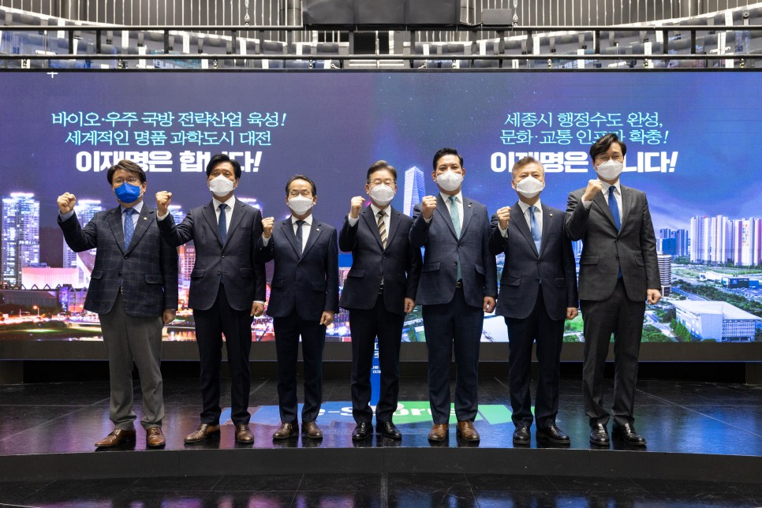
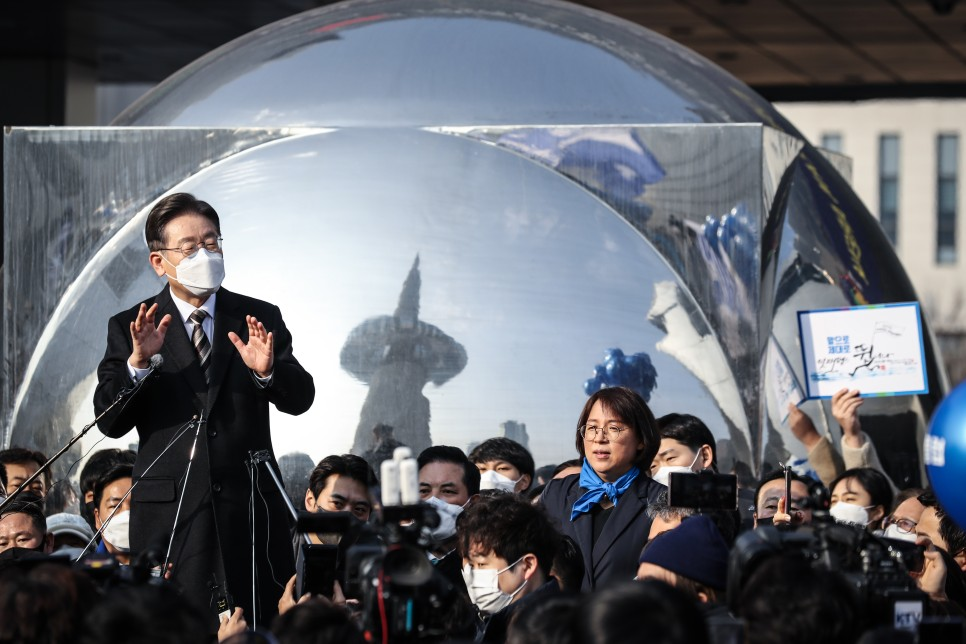
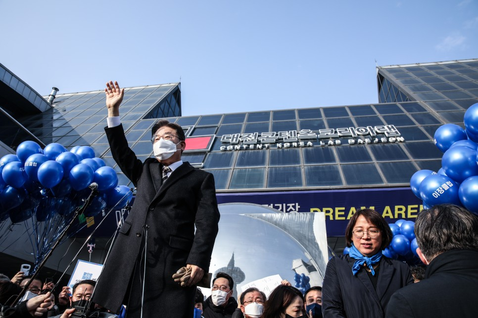

## 지역공약
# 세종시 행정수도 완성, 문화·교통 인프라 확충! 이재명은 합니다!
> 2022-02-12 12:03:06

존경하는 세종시민 여러분.

​

인구‧경제‧일자리‧교육과 같은 모든 인프라가 수도권에 집중된 1극 체제로 인한 불평등의 심화는 대한민국의 지속가능성마저 위협하고 있습니다.

​

그렇기에 국가 균형발전은 대한민국의 미래를 위한 최우선 과제입니다.

​

대한민국 국토의 중심, 행정수도 세종시는 김대중 대통령과 노무현 대통령의 꿈이 깃든 희망이자 앞으로 완성해야 할 과업입니다.

​

민주정부는 지난 20여 년간 행정의 중심 세종시를 시작으로 국가 균형발전을 일관되게 추진해 왔습니다.

​

저 역시 명실상부한 행정수도 세종을 완성하는 것에서부터 대한민국의 균형발전, 국토 대전환을 추동하겠습니다.

​

이를 위한 이재명 정부의 세종시 6대 공약을 말씀드리겠습니다.

첫째, 행정수도를 명문화하는 개헌을 추진하겠습니다.

균형발전과 지방분권을 제대로 강화하고 행정수도를 완성하기 위한 법적 기반을 마련하겠습니다.

​

향후 개헌 논의가 시작되면 ‘수도 조항’을 신설해 추진하겠습니다. 세종시가 실질적인 행정수도로서 충실히 기능할 수 있도록 세심한 노력을 기울이겠습니다.

둘째, 대통령 세종집무실 설치와 국회 세종의사당 건립을 조속히 추진하겠습니다.

지난해 국회법 개정안이 통과되면서 오랜 숙원이던 국회 세종의사당 건립의 첫발을 뗐습니다. 국회뿐만 아니라 청와대 세종집무실 설치를 조속히 추진해 세종시에서 대통령이 일하는 모습을 보여드리겠습니다.

​

행정과 정치의 물리적 분리로 인한 비효율을 개선하겠습니다.

​

세종시에서 행정과 정치가 함께하며 상호 견제와 균형을 이룰 때 세종시가 진정한 의미의 행정수도로 거듭날 수 있을 것입니다.

셋째, 공공기관 세종시 이전과 법원 설치를 단계적으로 추진하겠습니다.

44곳의 중앙행정기관이 세종시로 이전했지만, 일부는 여전히 수도권에 잔류하고 있습니다. 물리적인 분리 때문에 업무협조나 의사소통에 있어 비효율이 발생하곤 합니다.

​

남아 있는 공공기관의 세종시 이전을 조속히 추진해 효율을 극대화하고 행정수도로서의 기능을 강화하겠습니다.

​

세종의 인구 증가와 함께 늘고 있는 사법 수요에 대응할 수 있도록 법원 설치를 추진하겠습니다.

​

넷째, 행정수도 위상에 맞게 세종에 문화적 인프라를 확대하겠습니다.

현재 국회 세종의사당 예정 부지 인근에 대한민국 최초의 국립박물관 단지가 조성되고 있습니다.

​

국립민속박물관을 중심으로 디지털 문화유산센터, 도시건축 박물관, 디자인 박물관, 어린이 박물관과 같은 시설을 차질없이 조성해 나가겠습니다.

​

이를 통해 충청도민과 세종시민께서 풍부한 인프라 안에서 문화를 향유하실 수 있도록 하겠습니다.

​

다섯째, 세종 스마트 헬스시티 조성을 추진하겠습니다.

세종시에 AI‧자율주행‧빅데이터‧첨단의료와 같은 혁신기술을 활용한 스마트 헬스시티 조성을 추진하겠습니다.

​

세종시의 스마트 헬스시티가 세계를 선도하는 미래도시 모델로 자리 잡도록 브랜드화하겠습니다.

​

‘스마트시티 국가 시범도시’로 지정된 5-1 생활권을 고도화하겠습니다. 5-2 생활권은 헬스케어가 더욱 특화된 스마트 헬스시티로 개발해 100세 시대의 주거와 생활문화를 선도하겠습니다.

​

보건‧의료기관과 헬스케어 관련 기업의 유치를 지원하고 보건 위기 상황 대응과 양질의 의료서비스를 위한 공공의료기관 설립을 지원하겠습니다.

여섯째, 세종시 광역철도와 고속도로 조기 착공을 지원하겠습니다.

대전~세종~충북을 잇는 광역철도의 조기 착공으로 충청권 메가시티의 기반을 닦겠습니다.

​

세종과 서울 간 환승 없는 직통 철도시대를 열겠습니다.

기존의 경부선과 신설되는 광역철도망을 활용해 서울에서 천안‧조치원과 세종 정부청사를 잇는 전철을 운행하겠습니다.

​

장기적으로는 경부선 국철 노선에 준고속열차를 투입해 서울과 세종을 60분대에 이동하도록 연결하겠습니다.

​

세종시 주변 지역과의 통행거리 단축과 물류비용 절감을 위해 계획돼 있는 세종~청주 고속도로를 조기에 착공하도록 하겠습니다.

세종~청주 고속도로가 완성되면 중부권과 세종시 간 접근성이 향상되고 세종시민의 교통 편의가 크게 개선될 것입니다.

존경하는 세종시민 여러분,

​

모두가 행정수도 세종을 말하지만 누구나 이를 실현할 수 있는 것은 아닙니다.

​

세종의 성장과 발전은 무엇을 약속하느냐 보다 누가 정말로 이를 실천하느냐에 달려 있습니다.

​

공약 이행률 95%가 넘는 사람, 실적으로 유능함을 증명해온 사람, 균형발전과 지방분권을 외쳐온 이재명이라면 할 수 있습니다.

​

약속을 지키는 사람에게 권한을 위임하면 세종시민 여러분의 삶이 정말로 달라진다는 것을 보여드리겠습니다.

​

세종시 행정수도 완성,

문화 ․ 교통 인프라 확충!

이재명은 합니다!

​

고맙습니다.

​

​

2022년 2월 12일

​

제20대 대통령선거 더불어민주당 후보 이 재 명