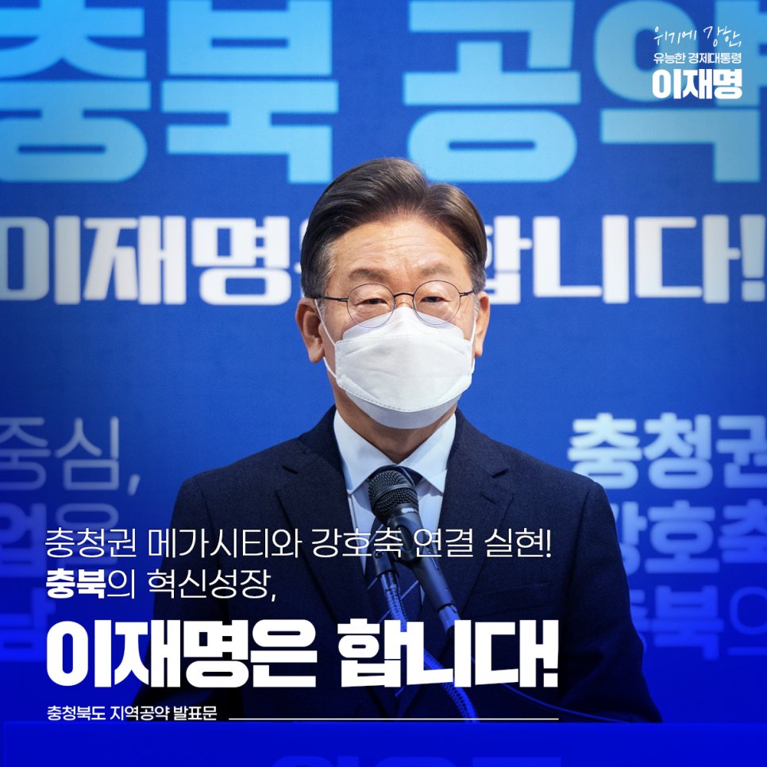
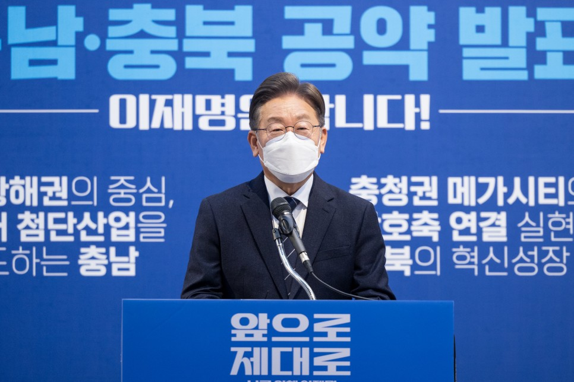
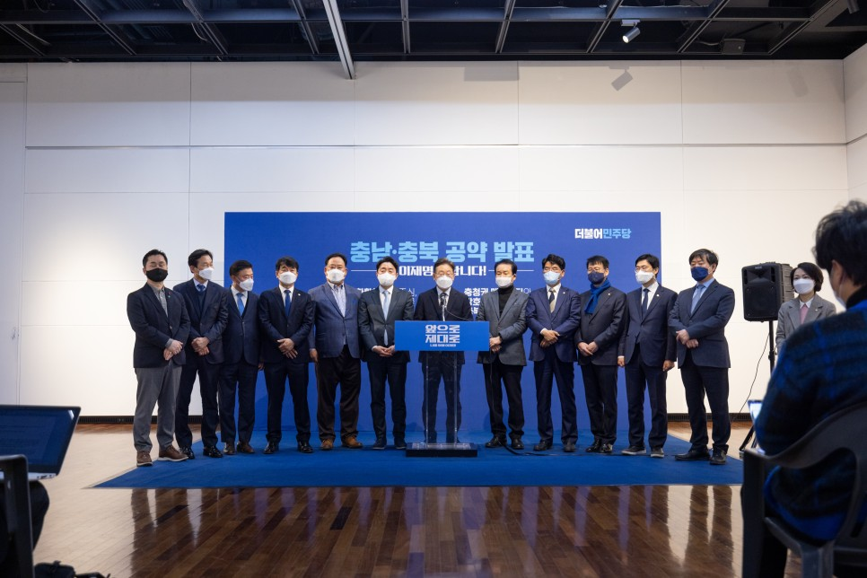
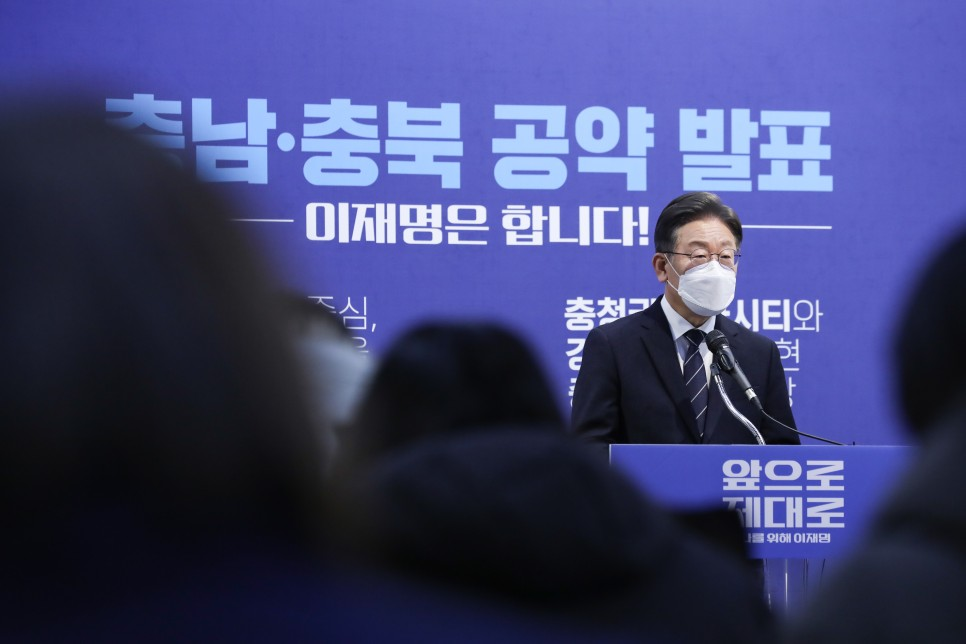
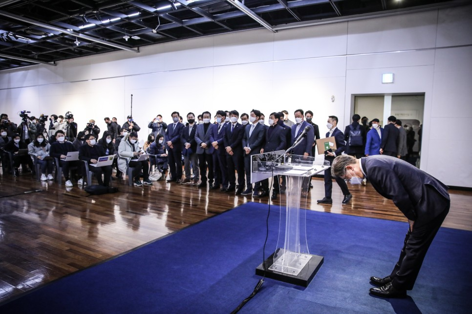
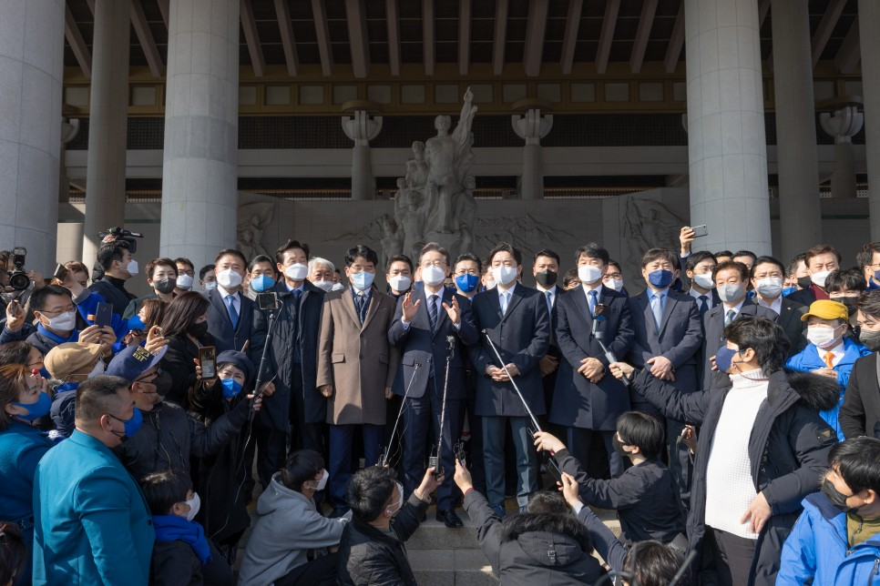
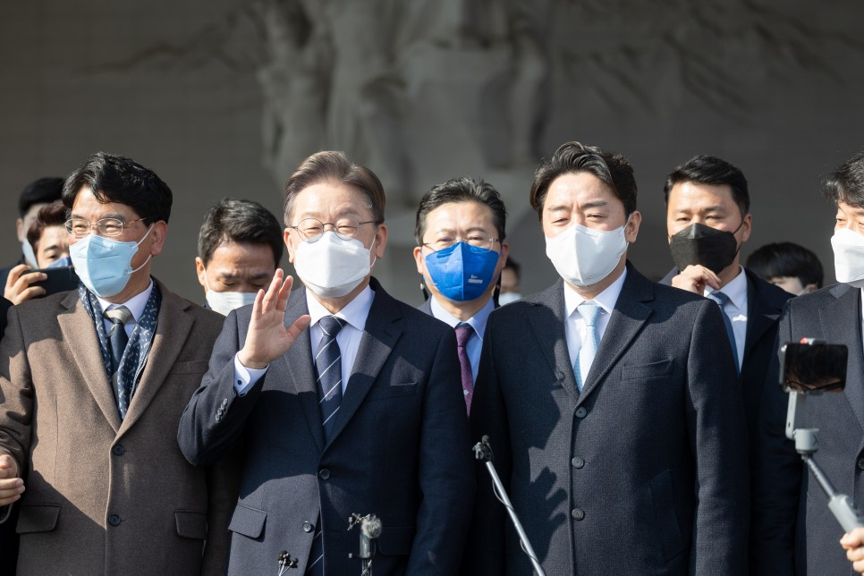

## 지역공약
# 충청권 메가시티와 강호축 연결 실현! 충북의 혁신성장, 이재명은 합니다!
> 2022-02-12 16:08:23

존경하는 충북도민 여러분!

​

충북은 국토 정중앙에 자리한 대한민국의 심장부입니다. 수도권과 영호남 지역을 이어주는 연결고리이자 치우치지 않는 중용의 미덕을 갖춘 지역입니다.

​

충북이 국가균형발전을 선도하는 것은 시대적 사명입니다. 대한민국의 중심인 충북의 발전은 국가 균형발전을 완성하는 지름길입니다.

​

충청권 메가시티 구축과 강호축 개발을 통해 대한민국은 국가 균형발전의 새로운 전기를 마련하게 될 것입니다.

​

충북의 바이오․신재생에너지 산업을 더욱 키우고 이차전지, 반도체, 철도산업과 같은 미래 신산업 육성으로 충북의 괄목상대한 성장을 이뤄내겠습니다.

​

이를 위해 충북의 사위 이재명이, 충청북도 지역 7대 공약을 말씀드리겠습니다.

첫째, 광역철도망과 청주공항의 인프라를 확충해 충청권 메가시티를 완성하겠습니다.

충청권 메가시티는 수도권 과밀화 극복과 국가 균형발전을 위한 최적의 전략입니다.

​

충청권 메가시티 완성을 위해서 제4차 국가철도망 구축계획에 반영된 대전~세종~충북 광역철도 노선이 청주 도심을 통과하도록 하겠습니다.

​

충청권에 한반도 동서축을 잇는 철도가 필요합니다. 충남 서산에서 천안과 청주를 거쳐 경북 울진을 연결하는‘중부권 동서횡단철도’건설을 적극 모색하겠습니다.

​

충북혁신도시와 청주국제공항 등 중부권과 수도권을 연결하는 교통축을 조기에 조성하겠습니다.

​

이전하는 공공기관이 정착할 수 있도록 청주공항~혁신도시~동탄 간 광역철도를 조속히 건설하겠습니다. 음성 감곡~혁신도시를 잇는 중부내륙선 지선이 국가철도망 계획에 반영되도록 적극 지원하겠습니다.

​

청주국제공항은 행정수도의 관문이자 중부권 거점공항으로서 국제공항 기능을 재정립하고 폭발적인 항공 수요 증가에 대비해 인프라를 대폭 확충하겠습니다.

​

대형항공기 이착륙과 항공 안전을 위해 활주로 재포장을 지원하겠습니다. 활주로 연장과 여객청사·화물청사 확충 방안을 적극 마련하겠습니다.

둘째, 강호축 고속철도망을 조기 구축하고 미래철도산업을 육성하겠습니다.

강호축은 경부축 중심의 국토개발정책으로 등한시되던 호남과 충청, 강원을 연결하는 초광역 국가발전 전략입니다.

​

강원~충북~호남을 연결하는 충북선 철도 고속화를 조기에 추진하여 대한민국의 X자형 고속철도망을 완성하겠습니다.

​

철도가 친환경 교통수단으로 새롭게 부상하고 있습니다. 철도종합시험선로와 완성차 시험 연구시설, 철도교통관제센터와 같은 R&D 기반이 집적된 충북 오송에 철도산업 국가산업단지 조성을 지원하겠습니다.

​

셋째, 충북 동부축 고속도로망 건설로 충북․경북의 상생발전을 이끌고 동서 5축을 완성하겠습니다.

대한민국의 대표 생태축인 백두대간권은 그동안 개발에서 소외되어 충북 동부권 내륙지역의 접근성이 열악합니다.

​

영동~옥천~보은~증평~진천 간 고속도로는 조기 추진하고 보은~괴산~충주~제천~단양을 잇는 고속도로는 국가 계획에 반영을 추진하겠습니다.

​

충북과 강원도를 연결하는 동서 5축 고속도로망 완성으로 전국 어디서나 대한민국 생태계의 보고인 월악산․속리산․소백산에 쉽게 닿을 수 있도록 하겠습니다.

넷째, 바이오․시스템반도체․이차전지․에너지․수소산업과 같은 신성장산업을 육성하겠습니다.

충북의 바이오산업 육성을 적극 뒷받침하겠습니다. 세계 바이오 시장을 견인하는 글로벌 바이오클러스터 조성사업 추진을 지원하겠습니다.

​

최상의 바이오산업 성장 기반이 조성된 충북 오송에 바이오의약품 생산 전문인력 양성센터 건립을 적극 지원하겠습니다.

​

천연물을 활용한 향(香) 산업을 육성하기 위해 제천 인공지능 융합기술센터 구축 사업을 지원하겠습니다.

​

충북은 국내 최고 수준의 반도체 생산지이자 세계적 수준의 반도체 후공정 기업이 밀집한 지역입니다. 이를 바탕으로 시스템반도체 첨단 패키징 플랫폼을 조속히 구축해 세계 최고 수준의 역량을 보여 줄 K-반도체 벨트를 완성하겠습니다.

​

충북에는 이차전지 업체들이 집적해 있고 오창과학산업단지가 이차전지 소․부․장 특화단지로 지정돼 있습니다. 오창에 글로벌 이차전지 R&D 선도 플랫폼을 구축해 K-배터리 발전을 이끌겠습니다.

​

차세대 다목적 방사광가속기와 부대연구시설 건립사업이 차질 없이 진행되도록 더욱 박차를 가하겠습니다.

​

에너지와 수소산업이 충북의 미래를 이끌도록 혁신도시에 조성하는 에너지산업 융복합단지 활성화를 적극 지원하고 음성과 충주에 그린수소산업 클러스터를 조성하겠습니다.

​

제천과 단양은 저탄소 청정연료 생산의 거점으로 육성하겠습니다. 저탄소 연료화 기술을 활용해 온실가스 감축과 대기환경 개선을 이루고 탄소중립을 견인하는 도시가 되도록 지원하겠습니다.

다섯째, 4차산업혁명 시대의 디지털 인재를 키워낼 맞춤형 AI 영재고 설립을 적극 지원하겠습니다.

충북에는 첨단산업 분야의 기업과 기관들이 자리잡고 있습니다. 충북 지역의 대학에서 디지털 인재 양성을 위한 첨단산업 관련 학과를 신설․개편하고 있으며 초․중학교도 디지털 영재 육성에 심혈을 기울이고 있습니다.

​

하지만 중간교육 단계인 첨단산업 맞춤형 고등학교는 충북에 전무합니다. 인재 수급 불균형으로 인한 인력 공백이 발생하지 않도록 하겠습니다. 충북이 기반을 갖추고 있는 첨단산업 분야로 진출할 디지털 인재를 육성하기 위해 AI 분야에 특화된 ‘AI 영재고 설립’을 적극 지원하겠습니다.

​

여섯째, 충북의 하천과 백두대간을 국민의 쉼터로 만들고 전통무예와 스포츠산업 육성을 지원하겠습니다.

충북의 젖줄인 미호강이 수질 오염과 수량 부족으로 황량해지고 있습니다. 미호강의 수질을 개선하고 수량을 확보해 생태계를 복원하고 활용을 높이겠습니다.

​

제대로 된 휴식과 여가 공간을 조성하는 ‘미호강 프로젝트’를 통해 생동감 넘치는 미호강을 충북도민 여러분께 돌려드리겠습니다.

​

충북 동부권에 속한 괴산․보은․옥천․영동은 각종 규제로 인한 개발 제한과 인구 감소, 낮은 재정자립도로 성장이 정체되어 왔습니다.

​

동부권에 위치한 백두대간을 자연 친화적 산림관광 거점으로 조성하겠습니다. 연계 교통망을 확충해 코로나 팬데믹에 지친 국민의 심신을 달래줄 국민 쉼터로 만들겠습니다.

​

충주․제천․단양의 충주호 일원을 연계하는 에코순환루트 조성사업과 저탄소 관광산업 생태계 구축 사업을 지원하겠습니다.

​

충북은 전통무예를 계승하며 무예 세계화를 선도해 왔습니다. 충북이 세계 무예의 중심으로 성장하도록 지원하겠습니다. 스포츠산업 육성을 위해 진천 국가대표 선수촌과 연계한 스포츠 테마타운 조성사업 지원 방안을 모색하겠습니다.

일곱째, 충북 서남부권 발전을 위해 청주교도소 이전을 추진하겠습니다.

40여 년 전에 건립된 청주교도소는 노후화됐을 뿐 아니라 청주시 도심 확장, 나아가 서남부권 개발에 심각한 걸림돌이 되고 있습니다.

​

청주교도소 이전은 20년 전부터 단골 공약이었으나 이전 비용과 대체 부지 확보가 어려워 난항을 겪어왔습니다.

​

더 이상 충북 서남부 지역주민의 희생을 강요할 수는 없습니다. 청주시민과 지혜를 모아 청주교도소 이전 추진 방안을 적극 모색하겠습니다. 이를 통해 시민 중심의 쾌적한 주거환경과 충북 서남부권의 새로운 미래공간으로 만들겠습니다.

존경하는 충북도민 여러분!

​

강호축을 중심으로 모두가 골고루 잘사는 대한민국 균형발전은 충북의 성장과 도약을 위한 필수 조건입니다.

​

충북이 소외 없이 고르게 발전하도록 하여 충북의 성장이 공정성장의 귀감이 되도록 만들겠습니다.

​

저 이재명은 수도권의 지방정부 대표였지만 비수도권의 불균형 발전에 대한 부당함과 중앙정부의 지방자치 탄압에 단식투쟁으로 대항하면서 국가균형발전과 지방분권 실현에 앞장서 왔습니다.

​

지방정부와 협력하며 국가 균형발전을 이뤄내고 지역현안 문제 해결을 위해 머리를 맞대고 실천하겠습니다.

​

위기일 때 더욱 큰 능력을 발휘하며 갖은 난관을 돌파해온 저 이재명이 충북의 위기를 기회로 바꿔 대도약의 디딤돌을 마련하겠습니다.

​

충청권 메가시티와 강호축 실현으로 국가균형발전을 선도하는 충북,

미래신산업 육성으로 충북의 혁신성장과 대도약,

이재명은 합니다!

​

고맙습니다.

2022년 2월 12일

​

제20대 대통령선거 더불어민주당 후보 이 재 명