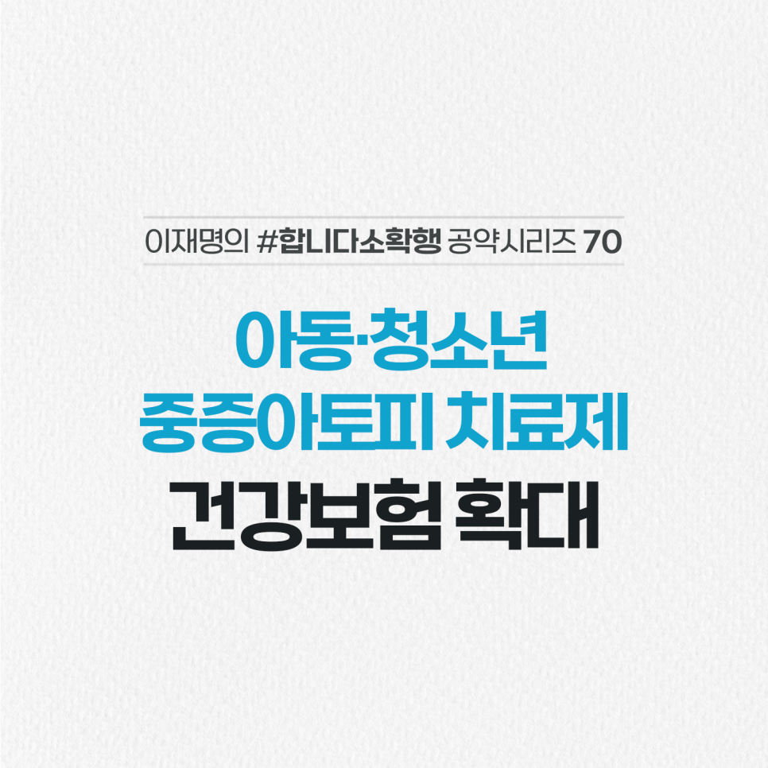

## 소확행 시리즈
# 아동·청소년 중증 아토피 치료제 건강보험 확대
> 2022-02-12 16:49:28

연 2천만 원에 달하는 고가의 중증 아토피 치료제는 성인 환자를 대상으로만 건강보험이 적용되고 있습니다.

​

식약처 승인 이후에도 아동과 청소년에 대한 건강보험 적용 여부가 결론이 나지 않고 있습니다.

​

신속하게 아동, 청소년에 대한 건강보험 적용 확대로 경제적 부담을 덜고 치료에만 전념할 수 있도록 하겠습니다.