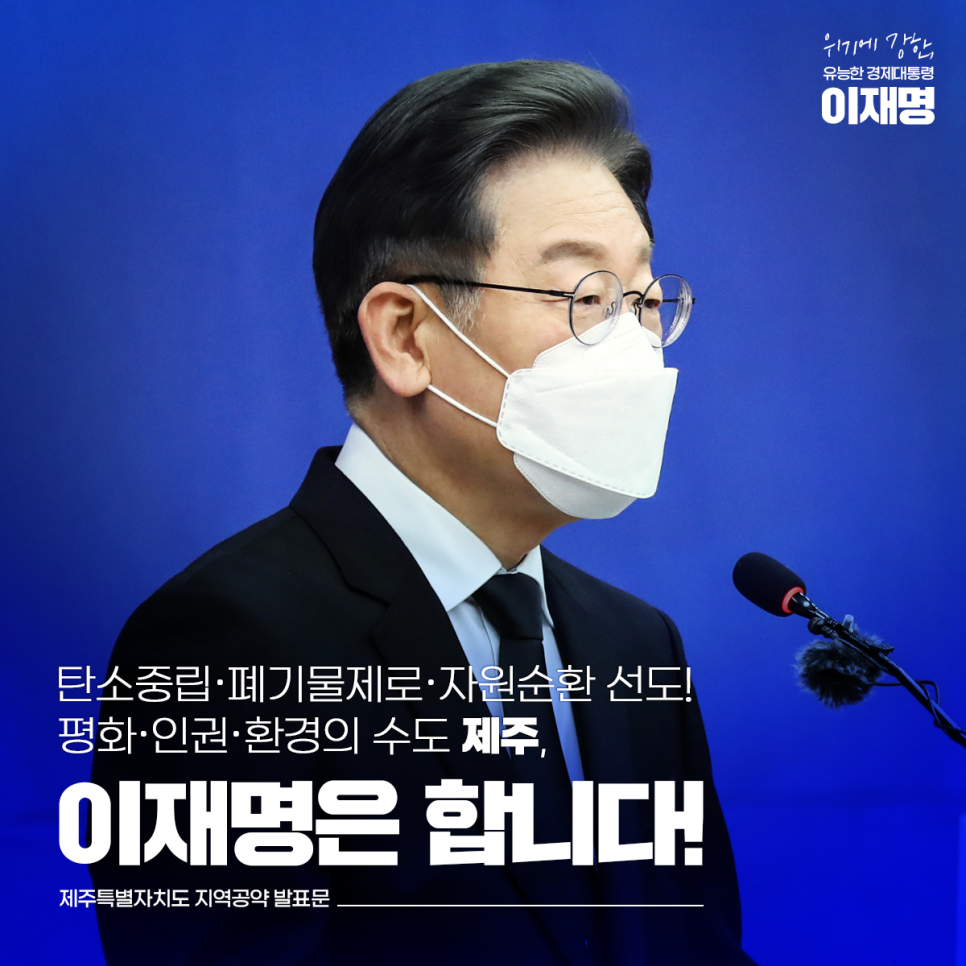
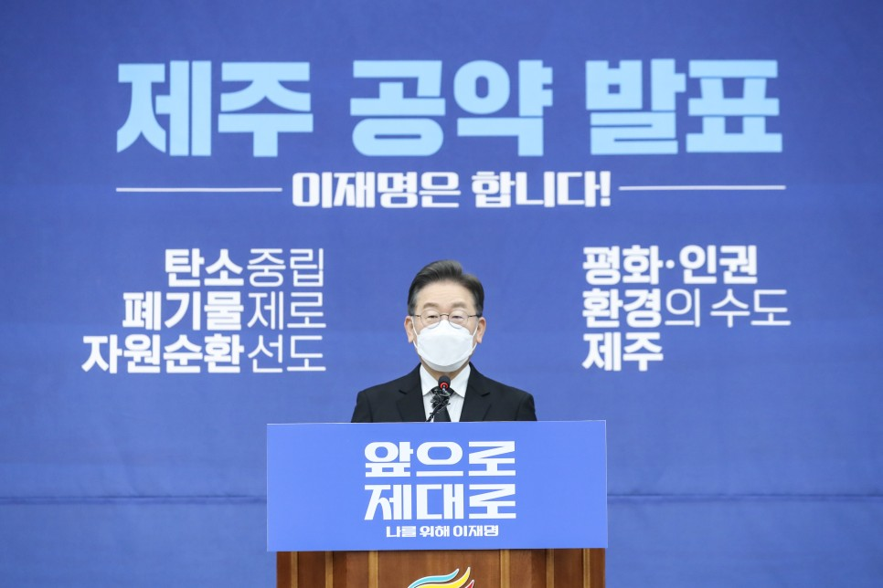
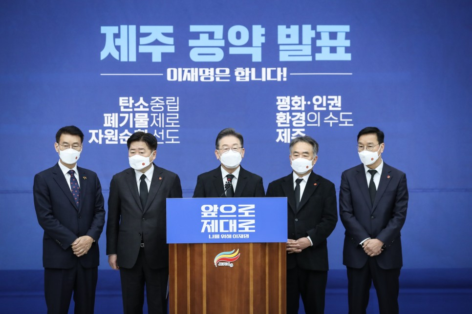
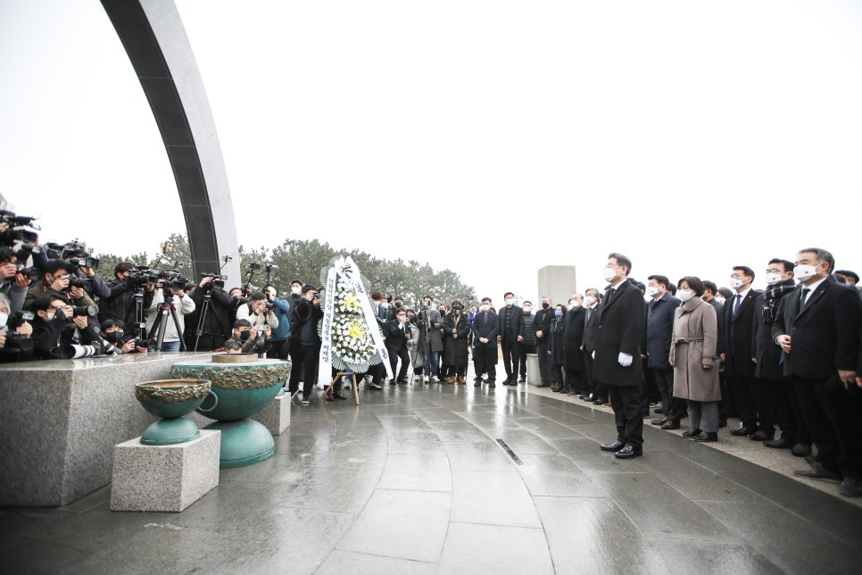
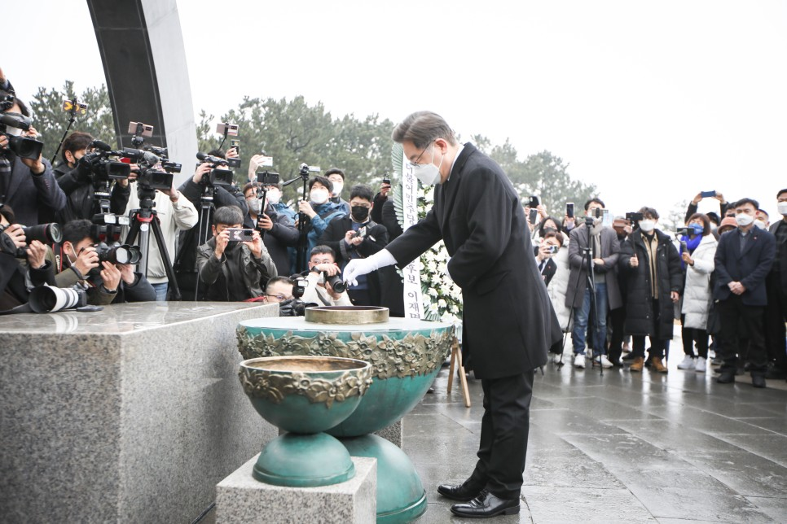
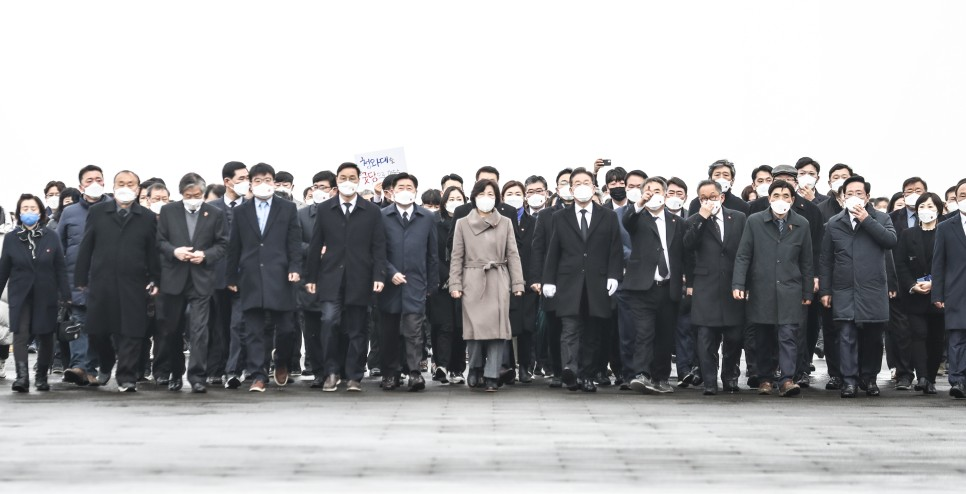
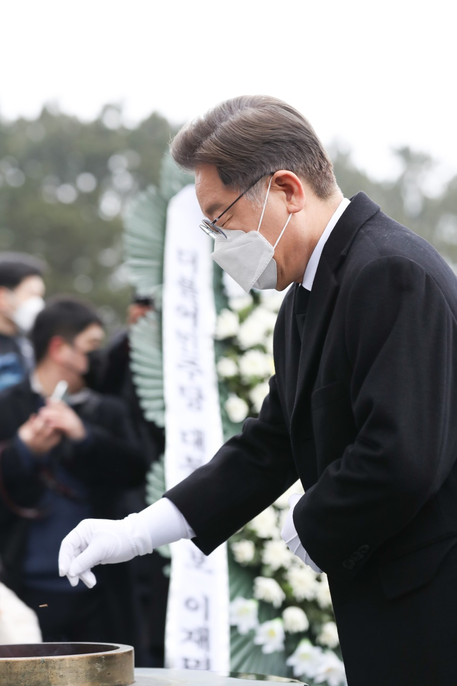
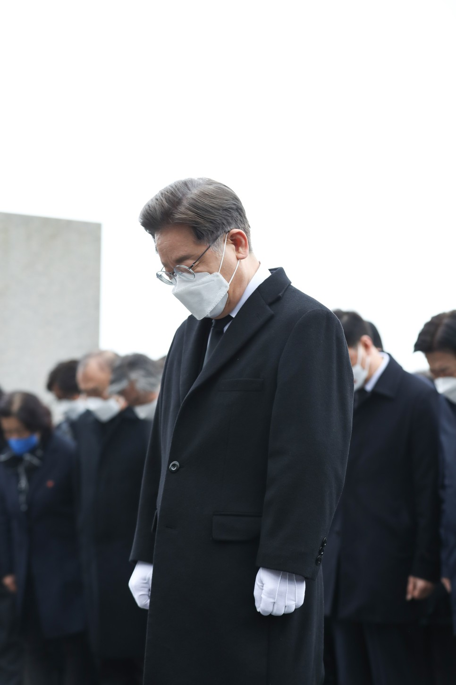
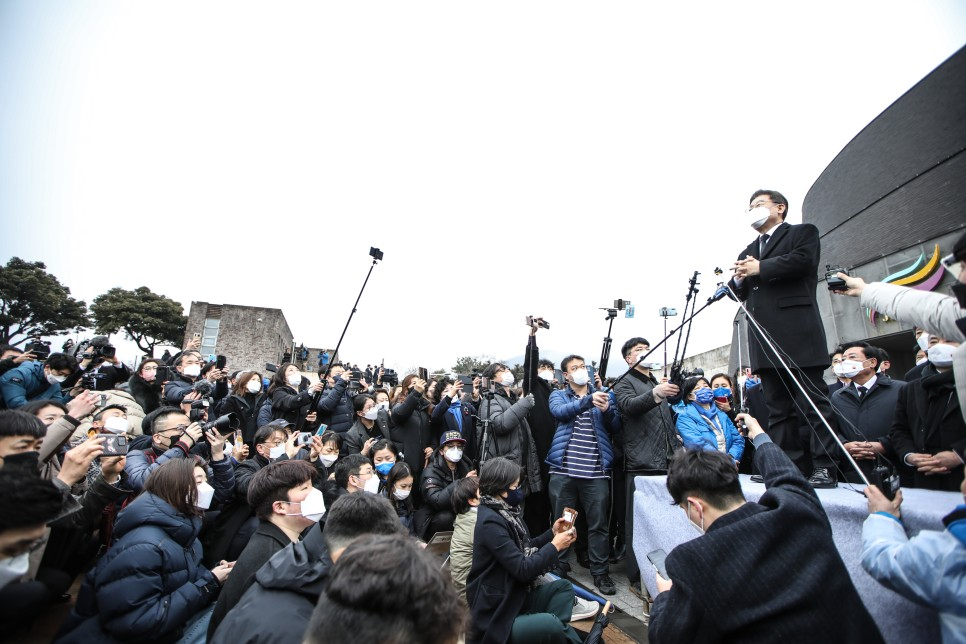
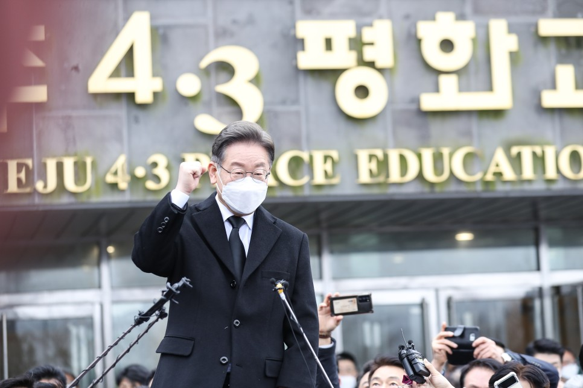

## 지역공약
# 탄소중립‧폐기물제로‧자원순환 선도! 평화‧인권‧환경의 수도 제주, 이재명은 합니다!
> 2022-02-14 10:33:23

존경하는 제주도민 여러분,

​

코로나 팬데믹으로 국경을 넘는 하늘길이 막히면서 제주를 찾는 국내 관광객이 늘어나고 있습니다. 그와 동시에 제주도민은 코로나19 확산, 쓰레기 폭탄, 하수 오염으로 일상을 위협받고 있습니다.

​

제주는 단순한 관광지가 아니라 천혜의 자연을 품고 있는 대한민국의 소중한 자원입니다. 전 세계 관광객이 에너지를 충전하고 삶의 동력을 회복하는 곳이 바로 제주입니다.

​

제주를 제주답게 회복시키고 대한민국의 미래를 선도하는 특별자치도로 완성해 나가겠습니다.

​

지속가능한 제주를 위한 이재명 정부의 9대 공약을 말씀드리겠습니다.

​

첫째, 제주를 폐기물 제로의 순환자원 혁신도시로 육성하겠습니다.

제주는 인구와 관광객의 증가로 생활폐기물 배출량 1위 지역입니다. 기초환경시설인 하수처리 수용량이 초과한 지 오래이고 도내 쓰레기 매립장도 포화상태에 이르렀습니다. 이제 제주의 패러다임은 개발중심 관광도시에서 대한민국의 환경수도로 바뀌어야 합니다.

​

제주 상수도 누수율이 43.3%에 이르렀습니다. 제주의 지하수 보호와 보전을 위해 물관리 체계를 획기적으로 개선하겠습니다. 제주하수처리장 현대화 사업을 지원하고 지하수와 해양의 오염을 방지하겠습니다.

​

환경보전기여금 제도를 도입하겠습니다. 하수종말처리 인프라 확대, 통합물관리체계 구축 지원과 같은 환경 분야에 재정을 투입해 도민 생활의 질을 높이겠습니다.

​

제주의 폐기물 발생지 처리원칙을 실현하고 재활용 산업을 육성하겠습니다. 제주도 폐기물은 제주도에서 처리할 수 있도록 제주 순환자원 혁신 클러스터를 조성하고 재활용 산업의 일자리 창출로 전환성장의 기반을 마련하겠습니다.

​

둘째, 햇빛과 바람의 섬 제주를 탄소중립 선도지역으로 육성하겠습니다.

재생에너지를 확대하고 남는 전력을 그린수소 생산 자원으로 활용해 탄소중립을 달성하도록 지원하겠습니다.

​

에너지원을 태양광․풍력과 같은 재생에너지로 100% 전환하고 전기차, 그린수소, 스마트 그리드와 같은 에너지 신산업을 육성하겠습니다.

​

이를 위해 분산에너지특구 지정을 추진하고 송배전망 인프라를 구축하는 이른바 에너지 고속도로를 제주에 가장 먼저 정착시키겠습니다.

​

셋째, 제주형 기본소득 시범 도입으로 도민의 경제기본권을 실현하겠습니다.

제주도의 물가는 연일 오르지만 도민의 임금수준은 전국에서 최하위 수준입니다. 이재명 정부의 기본소득 정책을 제주에 시범 실시하겠습니다.

​

도민이 직접 에너지협동조합을 만들고 주민소득형 재생에너지 사업에 참여하도록 지원하여 햇빛연금, 바람연금으로 제주도민의 소득을 확대하겠습니다.

넷째, 제주 4․3을 완전히 해결해 평화와 인권의 상징이 되도록 만들겠습니다.

제주 4․3의 완전한 해결을 위해 지속적 진상조사와 평화․치유 산업에 대한 국가지원을 대폭 확대하겠습니다. 제주 4‧3 기록물의 유네스코 세계기록유산 등재를 추진해 세계적인 과거사 해결 모델을 만들겠습니다.

​

지난 22년간 제주도민의 인내와 노력 끝에 지난해 2월 제주4․3특별법 전부개정안이 국회 본회의를 통과했습니다. 12월에는 배상과 보상을 위한 보완 입법이 이뤄졌습니다. 신속한 행정력을 발휘해 올해 차질 없이 보상금을 지급하고 가족관계 특례에 속도를 내겠습니다.

​

역사적 아픔의 상징인 알뜨르 비행장에 제주평화대공원 조성이 정상 추진될 수 있도록 하고 강정마을 공동체 회복을 위해 노력하겠습니다.

다섯째, 중앙-지방정부 간 협력모델을 구축하고 제주의 자치분권을 완성하겠습니다.

제주특별자치도 출범 이래 16년이 지났습니다. 특별자치제도 도입과 기초자치단체 폐지는 행정의 민주화, 주민직접참여, 균형발전 측면에서 부족함이 많았습니다. 제주의 국가균형발전 특별회계 재정이 감소함에 따라

행정서비스의 만족도는 낮아졌고 풀뿌리민주주의는 후퇴하고 있다는 지적이 있습니다.

​

제주특별행정지원청 설치 방안을 적극 모색하고 이양된 특별행정기관의 중앙-지방정부 간 협력모델을 효과적으로 구축하겠습니다.

​

제주지방법원 서귀포지원을 설치해 사법 서비스의 질을 높여나가겠습니다.

​

​
​
​

여섯째, 제주 국가항만 인프라를 확충하고 제주의 농축수산업 경쟁력을 높이겠습니다.

제주의 미래 성장기반인 국가항만 인프라를 확충하여 사람과 물류의 자유로운 이동권을 확대하겠습니다. 구도심 지역에 도시재생사업을 추진하고 국제 크루즈 거점항만으로서 해양문화 플랫폼 역할을 지원하겠습니다.

​

전자상거래를 위한 스마트 농수축산업플랫폼 구축, 농산물통합물류센터 건립, 농산물 해상운송 택배비 지원으로 제주 농축수산업의 경쟁력을 강화하겠습니다.

일곱째, 상급종합병원 지정과 감염병 전문병원 설치로 제주도민의 건강권을 확대하겠습니다.

제주에는 중증질환 치료를 전문으로 하는 상급종합병원, 신종 감염병에 대응할 수 있는 감염병 전문병원이 없습니다. 수술실, 회복실과 같은 전문치료 병상 수도 타지역보다 부족합니다.

​

관광객과 유동인구가 많은 제주의 특성을 감안하여 상급종합병원을 지정하고 감염병 전문병원을 설치하겠습니다.

​

중증 치료를 위해 외지로 나가야 하는 원정 진료의 불편을 해소하고 제주도 내 의료서비스의 질을 높이겠습니다.

여덟째, 제주를 일과 휴식, 관광을 모두 충족시키는 워케이션의 성지로 만들겠습니다.

코로나 팬데믹 이후 재택․원격 근무가 일상적인 형태로 자리 잡아가고 있습니다.

​

제주가 일과 휴식, 관광이 접목된 워케이션(Workation)의 성지로 자리 잡도록 적극 지원하겠습니다. 제주 어디서나 원격근무가 가능하도록 디지털 기반을 구축하겠습니다.

​

유니버설 디자인을 기반으로 이동에 제약이 없는 워케이션센터를 조성하겠습니다. 워케이션센터 이용자에게 지역상품권 할인 구입을 지원해 지역경제 활성화에 기여하도록 하겠습니다.

​

워케이션과 연계해 국제적 수준의 스포츠 인프라 확충을 지원하겠습니다.

아홉째, 바이오헬스와 우주데이터 산업을 제주의 미래산업으로 육성하겠습니다.

대전환의 위기를 돌파하기 위한 제주만의 성장전략이 필요합니다. 제주도 생물자원을 활용한 바이오헬스 산업을 육성해 환경자원이 새로운 성장동력이 되도록 하겠습니다.

​

항공우주연구원 데이터 센터를 설치해 항공우주기업과 우주데이터산업을 육성하겠습니다.

​
​
​
​
​

존경하는 제주도민 여러분!

​

제주가 가는 길이 대한민국의 미래가 되고 제주의 성공이 대한민국의 성장을 이끄는 동력이 되도록 하겠습니다.

​

대전환의 위기를 기회로 바꿔 제주의 평화, 상생의 꿈을 실현하고 도민이 잘 사는 제주를 만들겠습니다.

​

국민에게 한 약속을 95% 이상 지키면서 실력으로 실천해 실적을 쌓은 검증된 일꾼 저 이재명이 제주를 기회가 넘치는 희망의 섬으로 만들겠습니다.

​

탄소중립․폐기물제로․자원순환 선도!

평화․인권․환경의 수도 제주,

이재명은 합니다!

​

고맙습니다.

​

​

2022년 2월 13일

​

제20대 대통령선거 더불어민주당 후보 이 재 명