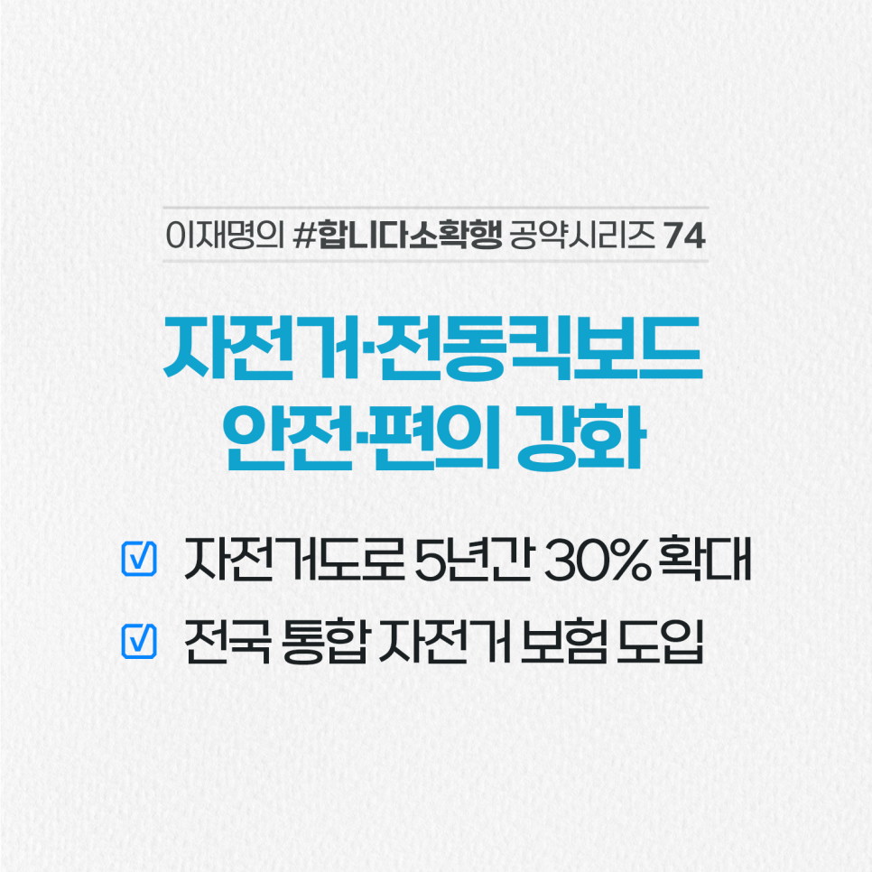

## 소확행 시리즈
# 안전과 편의를 위해 자전거 시설 투자를 늘리겠습니다
> 2022-02-19 16:45:09

어렵게 들어간 대학 시절 친구와 함께한 전국 자전거 일주는 지금도 행복한 기억입니다.

​

한편에는 자전거 사고로 한동안 병원에 입원한 아찔한 경험도 있습니다.

​

자전거와 전동킥보드는 이제 취미, 건강, 출퇴근 등 활용 범위가 넓어지고 있지만 여전히 안전과 편의 측면에서 미흡합니다.

​

거창한 시설 투자도 좋지만 국민의 일상과 안전부터 챙기겠습니다.

​

첫째, 자전거와 전동킥보드 전용도로를 중심으로 향후 5년 간 2020년 대비 30% 이상 확충하겠습니다.

​

둘째, 지자체 형편에 따라 다른 자전거 보험을 전국 단위 보험 제도로 만들겠습니다.

​

셋째, 도난방지장치가 설치된 자전거 주차장을 확충하고 방치된 자전거 관리제도를 만들겠습니다.

​

보행자, 자동차와 자전거가 서로 충돌하지 않고 안전하게 이용할 수 있는 환경을 조속히 만들겠습니다.