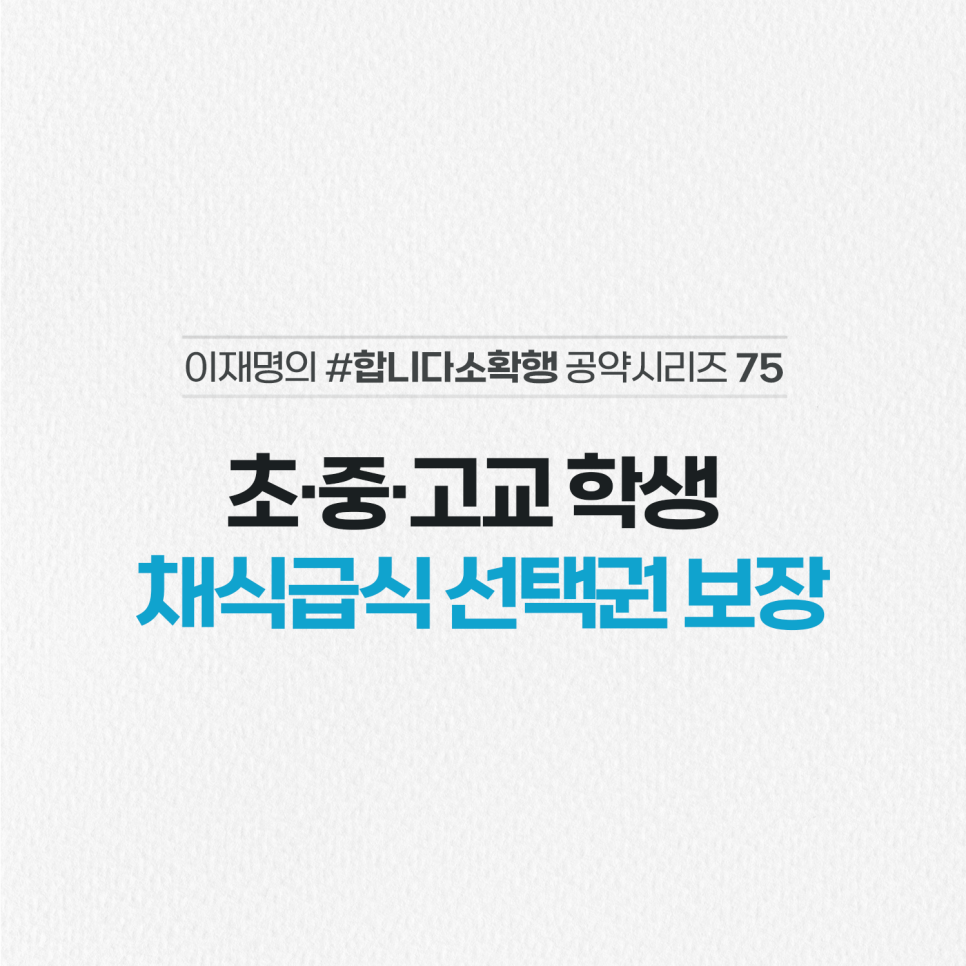

## 소확행 시리즈
# 초·중·고교 학생 채식급식 선택권 보장
> 2022-02-20 17:07:36

“채식하는 학생이 배식받는 것이 두려워 지지 않는 세상이 됐으면 좋겠다.”

제 아내가 담양 한 고등학교 학생에게 받은 편지입니다.

채식인구 200만 시대입니다. 건강·환경보호 등 다양한 목적으로 채식을 선택하고 있습니다.

2020년부터 국방부와 울산교육청도 채식급식을 허용하고 있으며, ‘고기 없는 월요일’ 등 다양한 캠페인도 진행 중입니다.

전국 어디서나 원하는 학생 누구든 마음 편하게, 균형 잡힌 채식 급식을 할 수 있도록 하겠습니다.

식단 개발 등 관련 연구와 급식담당자의 전문적인 연수도 실시하겠습니다.

지난 금요일부터 오늘까지 비건 페스타가 열립니다.

편지 주신 학생과 같은 분들이 불편 없이 식사할 수 있게 노력하겠습니다.

