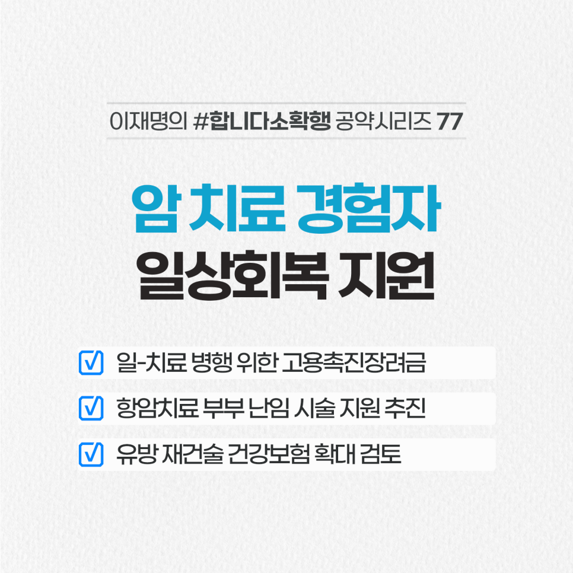

## 소확행 시리즈
# 암 치료 경험자 일상회복 지원
> 2022-02-25 08:44:58

암환자 10명 중 7명은 5년 이상 생존하지만 직장 복귀율은 30.5%에 불과합니다. 해외 평균 63.5%의 절반에도 못 미칩니다.

​

특히 청년의 경력단절 해소 등 모든 암 경험자의 일상 회복을 적극 돕겠습니다.

​

첫째, 암 경험자의 ‘일-치료 병행’을 지원하겠습니다.

​

탄력근무제 보장, 고용촉진 장려금 지원 등을 적극 검토하겠습니다.

​

둘째, 암 경험자의 ‘가정’을 지원하겠습니다.

​

항암치료를 앞둔 부부에 대한 난임 시술비 지원을 추진하고 암 경험자 자녀의 어린이집 우선 이용 기준 마련하겠습니다.

​

셋째, 치료를 위한 유방 재건술 건강보험 적용도 확대를 검토하겠습니다.

​

이 외에도 일터에서 암 경험자를 향한 차별이 없도록 꾸준히 제도 개선을 하겠습니다.

​

이 공약은 이낙연 총괄선대위원장님의 ‘국민에 대한 약속’을 기초로 하고 있습니다.

​

‘청년 암 치료는 인생의 마침표가 아닌 쉼표’라는 세심한 뜻을 함께 실현하겠습니다.