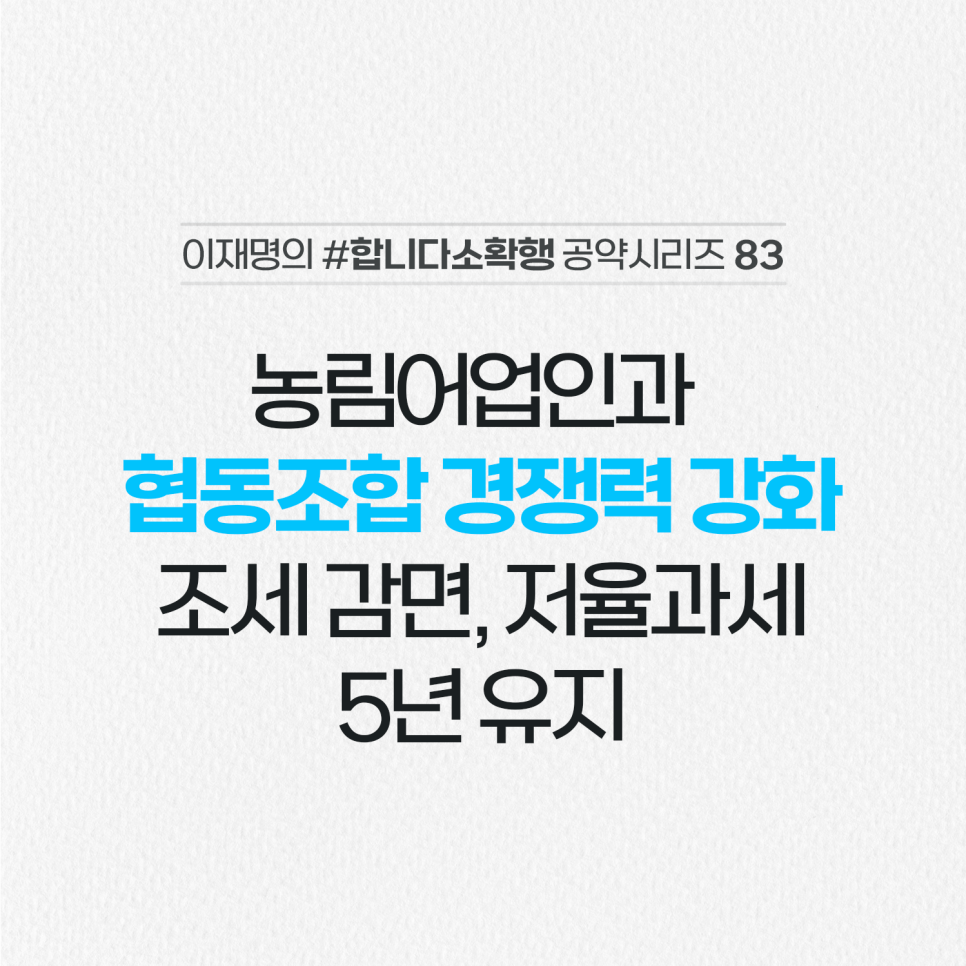

## 소확행 시리즈
# 안정적 소득 보장과 경쟁력 강화 위해 농림어업인과 협동조합의 세제감면 혜택을 유지하겠습니다
> v2022-03-01 17:38:51

농어업의 국가경쟁력을 지키기 위해 농어업인과 농협, 수협 등에 각종 비과세 혜택을 제공하고 있습니다.

​

농림어업인들에 대해서는 비료·농약·농기계·어선과 같은 농림어업용 기자재 구입시 부가가치세 영세율을 적용하며, 농지와 같은 고정자산 구입 시에는 취득세를 감면하고 있습니다.

​

농협과 수협 등 협동조합도 일정 금액 이하 출자금과 예탁금에 대한 이자소득세를 내지 않고, 법인세도 감면해주고 있습니다.

​

그런데 세제감면 혜택이 2년마다 연장되는 일몰제로 운영하면서 반복되는 당사자들의 불안과 불편을 겪으며, 불필요한 사회적 비용이 발생하고 있습니다.

​

앞으로 5년간 농림어업인과 협동조합에 대한 각종 조세 감면과 저율 과세를 유지하겠습니다.

​

나아가 농림어업용 기자재 부가가치세 영세율 대상 품목 확대도 검토하겠습니다.

​

농림어업인의 안정적인 소득 보전과 협동조합의 농림어업 경쟁력 기반 구축을 위해 지속적으로 노력하겠습니다.