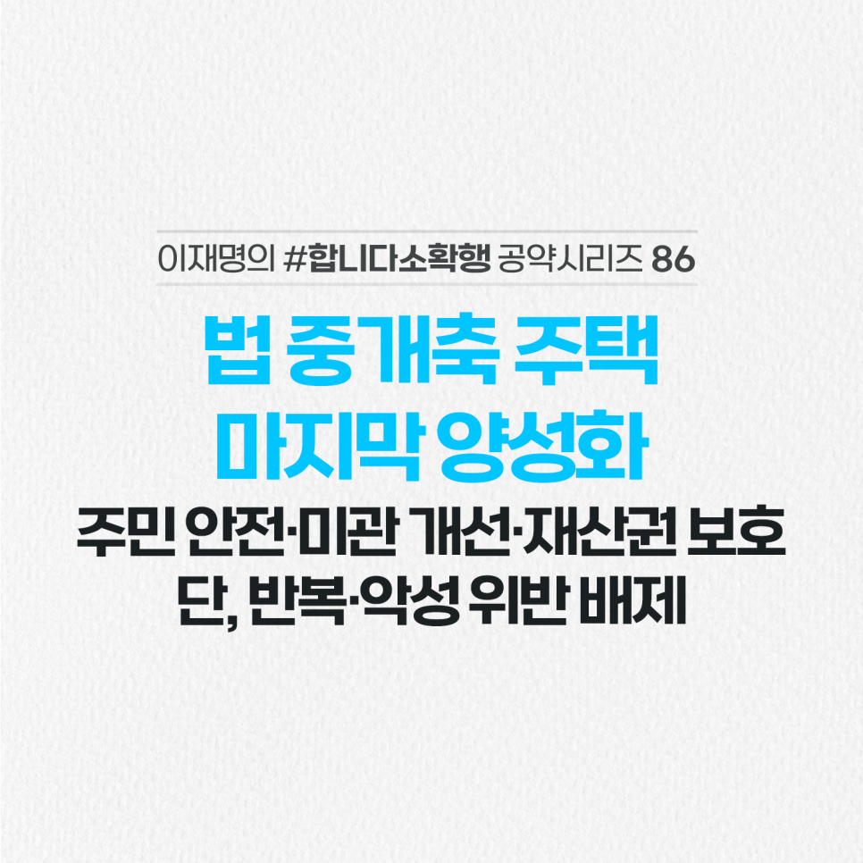

## 소확행 시리즈
# 불법 중개축 주택 마지막 양성화! 주민 안전·미관 개선·재산권 보호 단, 반복·악성 위반 배제
> 2022-03-05 17:26:23

옥상, 발코니 등의 불법 증개축 주택은 합법적인 증축‧개축‧대수선 등이 불가능합니다.

​

이런 주택들은 노후 되더라도 수리가 불가능해 구조적인 안전 문제, 도시미관 저해, 거주민 재산권 행사 제약 등의 문제가 발생하고 있습니다.

​

지난 2014년부터 총 5차례에 걸쳐 특별조치법에 따른 양성화 조치가 이뤄졌습니다만 여전히 불법건축물의 숫자는 전국적으로 82,000여호에 달합니다.

​

매년 부과되는 과태료 부담도 만만치 않습니다.

​

양성화 조치로 안전과 미관, 재산권 제약 문제를 해결하겠습니다.

​

법 준수 국민과의 형평성 차원에서 마지막 양성화 조치를 시행하겠습니다.

​

경중을 따져 위반 정보가 경미한 사안은 구제하겠습니다. 그러나 반복‧악성 중대 위반은 배제하겠습니다.

​

과도하게 까다롭고 경직적으로 운용되고 있는 건축법 규정을 합리적으로 개선해 불필요한 위반 사례 양산도 방지하겠습니다.