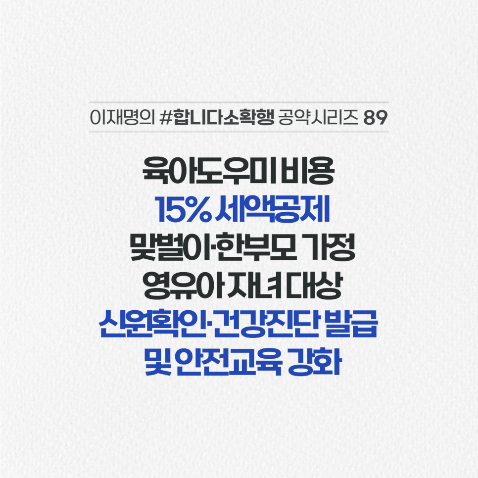

## 소확행 시리즈
# 맞벌이·한부모 가정 육아도우미 비용에 세액공제를 적용하겠습니다
> 2022-03-08 18:07:34

맞벌이 가구의 증가로 아이 돌봄 수요가 늘고 있지만 공급이 충분하지 못해 돌봄 공백이 여전히 큽니다.

​

정부의 아이돌봄 서비스는 중위소득 150% 이하에게만 비용 일부를 지원해 대부분의 맞벌이 가정은 지원에서 제외됩니다.

​

상대적으로 가격이 비싼 민간 시장에 의존하느라 부담도 만만치 않습니다.

​

육아도우미 비용 및 걱정을 덜고 돌봄공백을 메우겠습니다.

​

첫째, 영유아를 양육하는 맞벌이·한부모 가정이 육아도우미 이용 시 어린이집·유치원과 동일하게 세액공제 15%를 적용하겠습니다.

​

둘째, 육아도우미의 범죄경력조회 신청 제도 및 응급 시 안전보호조치 교육을 강화하겠습니다.

​

신원확인증명서 및 건강진단서 발급제도를 활성화해서 더욱 안심하고 아이를 맡길 수 있도록 돕겠습니다.